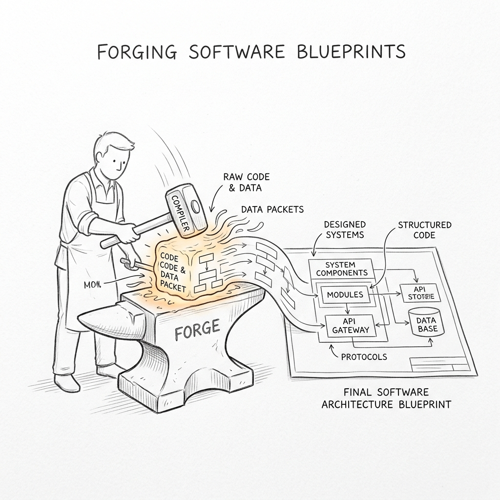
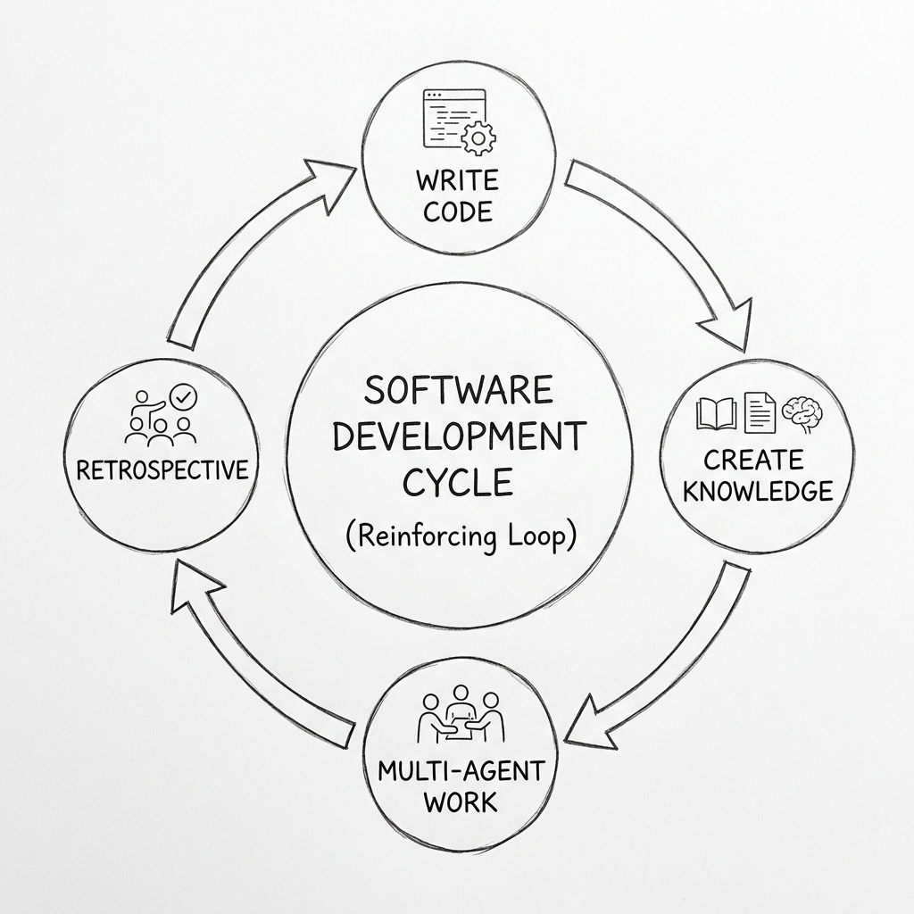

# Forge

<div align="center">
  
</div>

<div align="center">
  <strong>A self-enhancing AI software development lifecycle for Claude Code.</strong>
</div>
<br/>

AI coding assistants are incredibly powerful, but raw intelligence without structure leads to chaos. **Forge** turns your `Claude Code` instance into a highly disciplined, self-improving engineering organization in minutes. 

It analyzes your codebase and generates a complete, project-specific engineering practice: agent personas, workflows, document templates, review checklists, and deterministic tools—all strictly tailored to your project's unique tech stack, entities, and team conventions. 

**It doesn't just write code; it plans, reviews, approves, and gets smarter with every single task.**

---

## Why Forge?

| **Zero-Config Structure** | **Multi-Agent Orchestration** | **Continuous Learning** |
| :--- | :--- | :--- |
| Discovers your routing, models, tests, and CI pipelines automatically on initialization. | Deploys specialized roles: **Engineer** (plans/builds), **Supervisor** (reviews), and **Architect** (approves). | Every retrospective feeds the knowledge base. The system gets ~25% smarter every sprint. |

---

## The Self-Enhancing Flywheel

<div align="center">
  
</div>

Forge is not a static set of prompts. Every agent actively writes back what it discovers about your project:
*   The **Supervisor** adds new architectural patterns to the stack checklist when it catches them.
*   The **Bug Fixer** tags root cause categories and builds preventive checks.
*   The **Retrospective** promotes recurring patterns and prunes stale rules.
*   The **Engineer** updates domain docs when it uncovers undocumented business logic.

By Sprint 3, the `stack-checklist.md` adapts from 5 auto-detected items to over 25 rules—all earned from real project experience.

---

## What Forge Does

```text
Your codebase → /forge:init → Complete SDLC instance → Self-enhancing flywheel
```

1. **Scans** your project to discover stack, entities, routes, tests, build pipeline
2. **Generates** a knowledge base (~60% accurate on Day 1, improving rapidly)
3. **Generates** project-specific agent workflows, templates, and tools in your stack's language
4. **Runs** a multi-agent lifecycle: Engineer plans → Supervisor reviews → Engineer implements → Supervisor reviews code → Architect approves
5. **Learns** — every workflow writes back what it discovers about the project

---

## Installation

### Prerequisites
- [Claude Code](https://claude.ai/code) v1.0.33 or later
- The `agentic-skills` marketplace registered (one-time setup)

### Register the marketplace
If you haven't used any `agentic-skills` plugins before, add this to your Claude Code settings (`~/.claude/settings.json`):

```json
{
  "extraKnownMarketplaces": {
    "agentic-skills": {
      "source": {
        "source": "github",
        "repo": "Entelligentsia/agentic-skills"
      }
    }
  }
}
```

### Install the plugin
```bash
/plugin install forge@agentic-skills
```
*This installs Forge globally, making the `/forge:*` commands available in any directory.*

### Verify
Run `/help`—you should see `forge:init`, `forge:regenerate`, `forge:update-tools`, and `forge:health`.

---

## Quick Start: New Codebase

You have a project with code but no structured engineering practice. Forge will discover what's there and generate everything.

### 1. Initialize the SDLC
```bash
cd /path/to/your/project
/forge:init
```
Forge runs 9 automated phases (~10-15 minutes, no interaction needed):

| Phase | What Happens |
|-------|-------------|
| 1. Discover | Scans package.json, models, routes, tests, CI config |
| 2. Knowledge Base | Generates architecture docs, entity model, stack checklist |
| 3. Personas | Generates project-specific agent identities |
| 4. Templates | Generates document templates with stack-specific sections |
| 5. Workflows | Generates 14 agent workflows with your commands and paths |
| 6. Orchestration | Wires the task pipeline and sprint scheduler |
| 7. Commands | Creates `/engineer`, `/supervisor`, `/sprint-plan`, etc. |
| 8. Tools | Generates collate/validate/seed tools in your language |
| 9. Smoke Test | Validates everything connects, self-corrects if needed |

### 2. Review the Knowledge Base
Forge generates human-readable knowledge in the `engineering/` directory. Lines marked `[?]` need your attention:
*   `architecture/` (Database, Routing, Stack docs)
*   `business-domain/` (Entity Models)
*   `stack-checklist.md` (Initial code review criteria)

### 3. Plan & Execute
```bash
/sprint-plan            # The Architect helps define tasks, estimates & dependencies
/run-task ACME-S01-T01  # Drive task through: Plan → Review → Implement → Appprove
/retrospective S01      # The loop closes: review work & update the knowledge base
```

---

## Advanced Usage

### Existing Codebases with Engineering History
If you already have sprint artifacts or task history, Forge will gracefully integrate it. Run `/forge:init` as normal, then sequence your past artifacts into the AI database:
```bash
/collate
# or
python engineering/tools/seed_store.py
```

### The Generated SDLC Footprint
```text
.forge/                              SDLC infrastructure (Store, Config, Workflows)
engineering/                         Project knowledge (Docs, Sprints, Bugs, Checklists)
.claude/                             Standalone slash commands (/engineer, /sprint-plan)
```

### Generated Workflow Commands
After init, standalone agent commands are available:
| Command | Agent | Purpose |
|---------|-------|---------|
| `/engineer {TASK_ID}` | Engineer | Plan or implement a task |
| `/supervisor {TASK_ID}` | Supervisor | Review plan or implementation |
| `/fix-bug {BUG_ID}` | Engineer | Triage and fix a bug |
| `/approve {TASK_ID}` | Architect | Final sign-off |
| `/sprint-plan` | Architect | Plan a new sprint |
| `/run-task`, `/run-sprint` | Orchestrator | Full execution pipelines |
| `/retrospective {SPRINT_ID}` | Architect | Sprint closure and learning |

---

## Supported Stacks

Forge adapts to any codebase that Claude Code can read, generating tools in your primary language and workflows in universal Markdown:
- **Python** (Django, FastAPI, Flask)
- **JavaScript/TypeScript** (Express, Next.js, Nuxt, React, Vue)
- **Go** (Standard library, Gin, Echo)
- **Ruby** (Rails)
- **Rust** (Actix, Axum)

---

## Origin & Vision

Forge was distilled from the AI-SDLC system built at [WalkInto](https://walkinto.in), an enterprise 360° virtual tour SaaS platform. After thousands of AI operations, 28 sprints, 100+ tasks, and 90+ bugs managed through a multi-agent system, those specialized patterns were generalized into a meta-system that can bootstrap itself into *any* codebase.

| **Dive Deeper** |
| :--- |
| [01. What is Forge & Why it Exists](vision/01-OVERVIEW.md) |
| [02. The Origin Story](vision/02-ORIGIN-STORY.md) |
| [05. The Self-Enhancement Flywheel](vision/05-SELF-ENHANCEMENT.md) |
| [09. SDLC Orchestration](vision/09-ORCHESTRATION.md) |

<br/>
<div align="center">
  <strong>License:</strong> MIT
</div>
