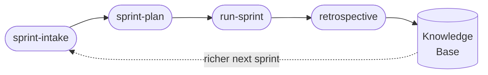
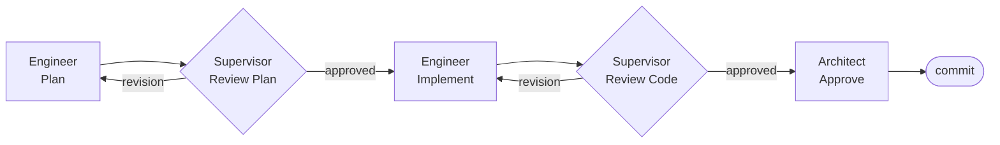

# Forge

<div align="center">
  
</div>

<div align="center">
  <strong>A self-enhancing AI engineering team for Claude Code — built from your codebase, not a template.</strong>
</div>

<br/>

---

## The Problem

Claude Code is capable. But left unstructured, it:

- Re-learns your project conventions from scratch every session
- Writes code without a second set of eyes — no plan review, no code review
- Has no memory of past decisions, bugs, or architectural tradeoffs
- Produces inconsistent results across tasks because there's no shared standard

The more complex your project, the worse this gets.

---

## What Forge Does

Forge runs once against your codebase and generates a complete, project-specific engineering practice — then deploys it as a multi-agent team inside Claude Code.

### Adapts itself to your project

Forge doesn't ask you to fill in a config file. It reads your codebase — routes, models, tests, CI pipeline, auth patterns — and generates personas, workflows, and review criteria that reflect how *your* project actually works. The Engineer persona knows your entity names. The Supervisor knows your security patterns. The Architect knows your deployment constraints.

### Self-learns with every cycle

Every completed task feeds the knowledge base. The Supervisor adds new patterns to the review checklist when it catches something worth catching again. The Bug Fixer tags root causes and builds preventive checks. The Retrospective agent promotes what's working and prunes what isn't. By Sprint 3, the system understands your project better than any static prompt ever could — and it keeps improving.

### Stack agnostic, with opinions where it counts

Forge generates everything in your language and adapts to whatever framework you're running. It makes no assumptions about your stack until it reads it. Where popular stacks have well-established best practices — Django migrations, Vue Composition API, Rails conventions — Forge's generated workflows encode those opinions explicitly. Everything else is derived from what it finds.

### Deterministic tools — LLM resources for thinking, not housekeeping

Forge is deliberately opinionated about what an LLM should and shouldn't do. Repeated, mechanical operations — collating sprint artifacts, seeding the task store, validating schema integrity — are generated once as deterministic tools in your project's own language and reused forever. Burning context tokens on tasks a script can do reliably is wasteful computing. Forge doesn't do it.

### A knowledge base built for surgical recall

The knowledge base is not a monolith. It is intentionally decomposed into focused documents — one for routing, one for the entity model, one for the stack checklist, one per architecture area. When an agent needs context, it loads exactly the relevant section and nothing else. This keeps every agent fast, focused, and cheap to run — and it gets sharper as the knowledge base matures.

### Context-efficient by design

Forge agents don't load your entire codebase into context on every task. They work from the curated local knowledge base built during init. Agents read exactly what they need for the task at hand. This keeps context lean, responses accurate, and costs predictable as the project grows.

### The Quiz — interview Forge about your own project

`/quiz` is a lightweight tool that turns the knowledge base into an interactive Q&A. Ask Forge about your architecture, your entities, your conventions — and if an answer is incomplete or wrong, say so. Forge uses that feedback as a guided session to patch the knowledge base on the spot. It's the fastest way to validate and sharpen what the system knows about your project.

### Discovers and recommends the skills your LLM will benefit from

During init, Forge checks the Claude Code marketplace for skills relevant to your stack — LSP intelligence for your language, framework-specific best practices, API integration skills. Already-installed skills are wired directly into generated personas: the Supervisor for a Vue project knows to invoke `vue-best-practices` before reviewing a component. New gaps surface in `/forge:health` so your tooling stays current as the project evolves.

---

## Install

**Prerequisites:** [Claude Code](https://claude.ai/code) v1.0.33+

```
/plugin install Entelligentsia/forge
```

`/forge:init`, `/forge:health`, `/forge:regenerate`, and `/forge:update-tools` are now available in any project.

---

## Start Using It

### On a new or existing project

```
cd /path/to/your/project
/forge:init
```

Forge scans your codebase and runs 9 automated phases (~10–15 min, no interaction needed):

| Phase | What happens |
|---|---|
| Discover | Reads your stack, routes, models, tests, CI config |
| Skill Recommendations | Checks installed skills, recommends marketplace additions for your stack |
| Knowledge Base | Generates `engineering/` — architecture docs, entity model, review checklist |
| Personas | Generates Engineer, Supervisor, Architect identities specific to your stack |
| Templates | Generates plan, review, and retrospective document formats |
| Workflows | Generates 15 agent workflows wired to your actual commands and paths |
| Orchestration | Assembles the task pipeline and sprint scheduler |
| Commands | Creates `/plan-task`, `/implement`, `/sprint-plan`, etc. in `.claude/commands/` |
| Tools | Generates `collate`, `validate-store`, `seed-store` in your project's language |
| Smoke Test | Validates everything connects; self-corrects if needed |

### After init — your first sprint

```
/sprint-intake            # Architect interviews you to capture structured sprint requirements
/sprint-plan              # Architect breaks requirements into tasks with estimates and dependency graph
/run-sprint S01           # Orchestrator drives all tasks through the pipeline in dependency waves
/retrospective S01        # Close the sprint and feed learnings back into the knowledge base
```



To drive a single task manually instead of the full sprint:

```
/run-task PROJ-S01-T01
```



### What was generated

```
.forge/               Config, workflows, templates, task/sprint/bug store
engineering/          Architecture docs, entity model, stack checklist, sprint history
.claude/commands/     Slash commands: /sprint-intake, /sprint-plan, /run-sprint, /run-task…
engineering/tools/    collate, validate-store, seed-store (in your language)
```

Lines marked `[?]` in `engineering/` are items Forge wasn't certain about — review and correct them before your first sprint.

---

## Day-to-Day Commands

| Command | What it does |
|---|---|
| `/sprint-intake` | Architect interviews you to capture and document sprint requirements |
| `/sprint-plan` | Architect breaks requirements into tasks, estimates, and dependency graph |
| `/run-sprint SPRINT-ID` | Orchestrator executes all sprint tasks in dependency waves |
| `/run-task TASK-ID` | Drives a single task through the full pipeline end-to-end |
| `/fix-bug BUG-ID` | Triage and fix a bug with root cause tracking |
| `/retrospective SPRINT-ID` | Closes a sprint and updates the knowledge base |
| `/forge:health` | Checks for stale docs, coverage gaps, and missing skills |
| `/forge:regenerate` | Refreshes workflows and personas from an enriched knowledge base |

---

## Supported Stacks

Forge adapts to any codebase Claude Code can read. Tools are generated in your primary language; workflows are universal Markdown.

**Python** · **TypeScript / JavaScript** · **Go** · **Ruby** · **Rust**

Frameworks detected automatically: Django · FastAPI · Flask · Express · Next.js · Nuxt · Vue · React · Rails · Gin · Echo · Actix · Axum — and anything else in the repo.

---

<div align="center">
  MIT License
</div>
