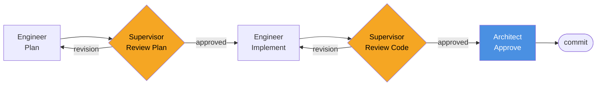

# Forge

<div align="center">
  
</div>

<div align="center">
  <strong>A self-enhancing AI engineering team for Claude Code — built from your codebase, not a template.</strong>
  <br/><br/>
  <a href="https://entelligentsia.in/open-source/forge">entelligentsia.in/open-source/forge</a>
</div>

<br/>

<div align="center">

[⚡ Quick Start](#quick-start) &nbsp;·&nbsp;
[📦 Install](#install) &nbsp;·&nbsp;
[🚀 Get Started](#get-started) &nbsp;·&nbsp;
[📖 Command Reference](docs/commands/index.md) &nbsp;·&nbsp;
[🗺️ Onboarding Guides](#get-started) &nbsp;·&nbsp;
[🔧 Customise](docs/customising-workflows.md) &nbsp;·&nbsp;
[🐛 Report a Bug](docs/commands/forge/report-bug.md)

</div>

---

## Summary

Forge is a Claude Code plugin that turns your codebase into a self-improving AI engineering team. Run it once on any project — it reads your stack, generates a complete set of project-specific agents, workflows, and a structured knowledge base, then deploys them as slash commands. Every sprint, the system learns from what it builds and gets sharper.

**One install. One init. A full engineering practice that improves with every task.**

---

## Quick Start

**1. Install Forge** (once, works across all your projects):
```
/plugin marketplace add Entelligentsia/forge
/plugin install forge@forge
```

> **Note:** Forge is pending approval in the Claude Code marketplace. Once listed, the install commands above will be the official route. In the meantime, installation instructions may vary — check the [repository](https://github.com/Entelligentsia/forge) for the latest.

**2. Bootstrap your project:**
```
cd /path/to/your/project
/forge:init
```
Forge scans your codebase and generates everything in ~10–15 minutes. No config files to fill in.

**3. Run your first sprint:**
```
/sprint-intake      # Capture sprint requirements in a structured interview
/sprint-plan        # Break requirements into tasks with estimates and dependencies
/run-sprint S01     # Execute — Plan → Review → Implement → Review → Approve → Commit
/retrospective S01  # Close the sprint and feed learnings back
```

That's it. Forge handles the rest.

---

## The Problem

Claude Code is capable. But left unstructured, it:

- Re-learns your project conventions from scratch every session
- Writes code without a second set of eyes — no plan review, no code review
- Has no memory of past decisions, bugs, or architectural tradeoffs
- Produces inconsistent results across tasks because there's no shared standard

The more complex your project, the worse this gets.

---

## What Forge Does

Forge runs once against your codebase and generates a complete, project-specific engineering practice — then deploys it as a multi-agent team 

### Adapts itself to your project
Forge doesn't ask you to fill in a config file. It reads your codebase — routes, models, tests, CI pipeline, auth patterns — and generates personas, workflows, and review criteria that reflect how *your* project actually works. The Engineer persona knows your entity names. The Supervisor knows your security patterns. The Architect knows your deployment constraints.

<br clear="both"/>


### Self-learns with every cycle
Every completed task feeds the knowledge base. The Supervisor adds new patterns to the review checklist when it catches something worth catching again. The Bug Fixer tags root causes and builds preventive checks. The Retrospective agent promotes what's working and prunes what isn't. By Sprint 3, the system understands your project better than any static prompt ever could — and it keeps improving.

<br clear="both"/>


### Stack agnostic, with opinions where it counts
Forge generates everything in your language and adapts to whatever framework you're running. It makes no assumptions about your stack until it reads it. Where popular stacks have well-established best practices — Django migrations, Vue Composition API, Rails conventions — Forge's generated workflows encode those opinions explicitly. Everything else is derived from what it finds.

<br clear="both"/>


### Deterministic tools — LLM resources for thinking, not housekeeping
Forge is deliberately opinionated about what an LLM should and shouldn't do. Repeated, mechanical operations — collating sprint artifacts, seeding the task store, validating schema integrity — are generated once as deterministic tools in your project's own language and reused forever. Burning context tokens on tasks a script can do reliably is wasteful computing. Forge doesn't do it.

<br clear="both"/>


### A knowledge base built for surgical recall
The knowledge base is not a monolith. It is intentionally decomposed into focused documents — one for routing, one for the entity model, one for the stack checklist, one per architecture area. When an agent needs context, it loads exactly the relevant section and nothing else. This keeps every agent fast, focused, and cheap to run — and it gets sharper as the knowledge base matures.

<br clear="both"/>


### Context-efficient by design
Forge agents don't load your entire codebase into context on every task. They work from the curated local knowledge base built during init. Agents read exactly what they need for the task at hand. This keeps context lean, responses accurate, and costs predictable as the project grows.

<br clear="both"/>


### The Quiz — interview Forge about your own project
`/quiz` is a lightweight tool that turns the knowledge base into an interactive Q&A. Ask Forge about your architecture, your entities, your conventions — and if an answer is incomplete or wrong, say so. Forge uses that feedback as a guided session to patch the knowledge base on the spot. It's the fastest way to validate and sharpen what the system knows about your project.

<br clear="both"/>


### Improves itself through your feedback
Forge is a living system — and it gets better with yours. When something breaks or behaves unexpectedly, `/forge:report-bug` turns your experience into a structured GitHub issue in seconds. It reads your Forge version, project stack, and OS automatically, interviews you for the details that actually matter, drafts the report in the standard Forge bug format, and files it to the Forge repository with one confirmation. No copy-pasting error messages into a browser form.
<br/><br/>
Every bug report feeds directly into the Forge meta-definition — the same source that generates your SDLC. Patterns reported by users become better specs, better guard-rails, and sharper smoke tests for everyone running Forge. The system that learns from your project also learns from you.

<br clear="both"/>


### Discovers and recommends the skills your LLM will benefit from
During init, Forge checks the Claude Code marketplace for skills relevant to your stack — LSP intelligence for your language, framework-specific best practices, API integration skills. Already-installed skills are wired directly into generated personas: the Supervisor for a Vue project knows to invoke `vue-best-practices` before reviewing a component. New gaps surface in `/forge:health` so your tooling stays current as the project evolves.

<br clear="both"/>

---

## Install

**Prerequisites:** [Claude Code](https://claude.ai/code) v1.0.33+

```
/plugin marketplace add Entelligentsia/forge
/plugin install forge@forge
```

`/forge:init`, `/forge:health`, `/forge:regenerate`, `/forge:update-tools`, and `/forge:report-bug` are now available in any project.

> **Note:** Forge is pending approval in the Claude Code marketplace. Once listed, the install commands above will be the official route. In the meantime, installation instructions may vary — check the [repository](https://github.com/Entelligentsia/forge) for the latest.

---

## Get Started

Choose the guide that matches your situation:

| I want to… | Guide |
|---|---|
| Onboard an existing codebase into Forge | [Existing project →](docs/existing-project.md) |
| Start a new project with Forge from day 1 | [New project →](docs/new-project.md) |
| Understand how the default workflows operate | [Default workflows →](docs/default-workflows.md) |
| Adapt Forge pipelines and workflows to my team's process | [Customising workflows →](docs/customising-workflows.md) |

---

## How it works

```
/forge:init  →  review engineering/  →  /sprint-intake  →  /sprint-plan  →  /run-sprint  →  /retrospective
```

`/forge:init` scans your codebase and runs 9 automated phases (~10–15 min, no interaction needed):

| Phase | What happens |
|---|---|
| Discover | Reads your stack, routes, models, tests, CI config |
| Skill Recommendations | Checks installed skills, recommends marketplace additions for your stack |
| Knowledge Base | Generates `engineering/` — architecture docs, entity model, review checklist |
| Personas | Generates Engineer, Supervisor, Architect identities specific to your stack |
| Templates | Generates plan, review, and retrospective document formats |
| Workflows | Generates 15 agent workflows wired to your actual commands and paths |
| Orchestration | Assembles the task pipeline and sprint scheduler |
| Commands | Creates `/sprint-intake`, `/sprint-plan`, `/run-sprint`, `/run-task`, etc. in `.claude/commands/` |
| Tools | Generates `collate`, `validate-store`, `seed-store`, `manage-config` in your project's language |
| Smoke Test | Validates everything connects; self-corrects if needed |

After init, each sprint task runs through the full pipeline automatically:



### What gets generated

```
.forge/               Config, workflows, templates, task/sprint/bug store
engineering/          Architecture docs, entity model, stack checklist, sprint history
.claude/commands/     Slash commands: /sprint-intake, /sprint-plan, /run-sprint, /run-task…
engineering/tools/    collate, validate-store, seed-store, manage-config (in your language)
```

Lines marked `[?]` in `engineering/` are items Forge wasn't certain about — review and correct them before your first sprint.

---

## Command Reference

Full lifecycle documentation — inputs, outputs, gate checks, revision loops, and diagrams — lives in the **[📖 command reference](docs/commands/index.md)**.

### Sprint commands

| Command | What it does | Reference |
|---|---|---|
| `/sprint-intake` | Architect interviews you and produces structured sprint requirements | [→](docs/commands/sprint/intake.md) |
| `/sprint-plan` | Breaks requirements into tasks with estimates and a dependency graph | [→](docs/commands/sprint/plan.md) |
| `/run-sprint SPRINT-ID` | Executes all sprint tasks in dependency waves | [→](docs/commands/sprint/run.md) |
| `/retrospective SPRINT-ID` | Closes a sprint and feeds learnings back into the knowledge base | [→](docs/commands/sprint/retrospective.md) |

### Task pipeline commands

| Command | What it does | Reference |
|---|---|---|
| `/run-task TASK-ID` | Drives a single task through the full pipeline end-to-end | [→](docs/commands/task-pipeline/run-task.md) |
| `/fix-bug BUG-ID` | Triage, root-cause, and fix a bug with knowledge base writeback | [→](docs/commands/task-pipeline/fix-bug.md) |

### Forge plugin commands

| Command | What it does | Reference |
|---|---|---|
| `/forge:init` | Bootstrap a complete SDLC instance from your codebase | [→](docs/commands/forge/init.md) |
| `/forge:health` | Detect stale docs, orphaned entities, and missing skills | [→](docs/commands/forge/health.md) |
| `/forge:regenerate [target]` | Refresh workflows, templates, tools, or knowledge-base docs | [→](docs/commands/forge/regenerate.md) |
| `/forge:update` | Propagate a plugin version upgrade into project artifacts | [→](docs/commands/forge/update.md) |
| `/forge:add-pipeline [name]` | Add or manage a custom task pipeline in `.forge/config.json` | [→](docs/commands/forge/add-pipeline.md) |
| `/forge:migrate` | Migrate a pre-existing AI-SDLC store to Forge format — interviews you to define the mapping | |
| `/forge:report-bug` | File a bug against Forge — gathers context and opens a GitHub issue | [→](docs/commands/forge/report-bug.md) |

---

## Security

Every release is scanned with `/security-watchdog:scan-plugin` before
publication. Reports are filed as versioned artifacts in
[`docs/security/`](docs/security/).

| Version | Date | Report | Summary |
|---------|------|--------|---------|
| 0.3.11 | 2026-04-04 | [scan-v0.3.11.md](docs/security/scan-v0.3.11.md) | 78 files — 0 critical, 3 warnings (all justified), SAFE TO USE |
| 0.3.10 | 2026-04-04 | [scan-v0.3.10.md](docs/security/scan-v0.3.10.md) | 84 files — 0 critical, 3 warnings (all justified), SAFE TO USE |
| 0.3.9 | 2026-04-04 | [scan-v0.3.9.md](docs/security/scan-v0.3.9.md) | 84 files — 0 critical, 3 warnings (all justified), SAFE TO USE |
| 0.3.8 | 2026-04-04 | [scan-v0.3.8.md](docs/security/scan-v0.3.8.md) | 83 files — 0 critical, 3 warnings (all justified), SAFE TO USE |

---

## Supported Stacks

Forge adapts to any codebase Claude Code can read. Tools are generated in your primary language; workflows are universal Markdown.

**Python** · **TypeScript / JavaScript** · **Go** · **Ruby** · **Rust**

Frameworks detected automatically: Django · FastAPI · Flask · Express · Next.js · Nuxt · Vue · React · Rails · Gin · Echo · Actix · Axum — and anything else in the repo.

---

<div align="center">
  MIT License · <a href="https://entelligentsia.in/open-source/forge/privacy">Privacy Policy</a>
</div>

<!-- 
Maintainer Note:
After saving `assets/forge_social.png`, upload it manually to set the social preview:
GitHub → Entelligentsia/forge → Settings → Social preview → Edit → Upload image
-->
