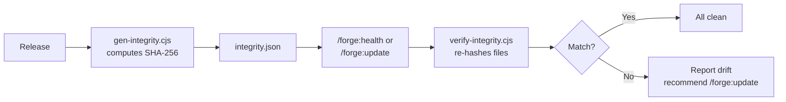

# Integrity

Forge uses a tamper-evident integrity system to detect unauthorized modifications to plugin files. It is not a security mechanism. It is a drift detector.

---

## How It Works

At release time, Forge computes SHA-256 hashes of plugin files and stores them in `integrity.json`. At runtime, the verifier re-hashes each file and compares against the manifest. If a hash does not match, the file has been modified. If a file is missing, it has been deleted.



---

## gen-integrity.cjs

Runs at release time. Scans four directories:

| Directory | Extension | Count (v0.28.0) |
|-----------|-----------|-----------------|
| `commands/` | `.md` | 19 |
| `agents/` | `.md` | 2 |
| `hooks/` | `.js` | 4 |
| `tools/verify-integrity.cjs` | `.cjs` | 1 |

Writes `integrity.json` with:

```json
{
  "version": "0.28.0",
  "generated": "2026-04-29",
  "note": "Tamper-evident only. Authoritative source: /forge:update from remote.",
  "files": {
    "commands/init.md": "sha256-hash...",
    "hooks/check-update.js": "sha256-hash..."
  }
}
```

Usage:

```bash
node gen-integrity.cjs --forge-root forge/ --version 0.28.0
```

---

## verify-integrity.cjs

Runs during `/forge:health` and `/forge:update`. For each entry in `integrity.json`:

1. Checks if the file exists (missing)
2. Computes the SHA-256 hash and compares against the manifest (modified)

Exit codes:
- 0 — all files unmodified
- 1 — one or more files modified or missing
- 2 — manifest missing

Output:

```
〇 Plugin integrity — all 30 files unmodified
```

Or on drift:

```
△ Plugin integrity — 2 files modified or missing:
  · commands/init.md (hash mismatch — run /forge:update to restore)
  · hooks/check-update.js (missing — run /forge:update to restore)
```

Usage:

```bash
node verify-integrity.cjs --forge-root forge/
```

---

## Generation Manifest

The generation manifest (`generation-manifest.cjs`) tracks which files are generated by Forge vs. modified by the user. This is separate from integrity — it detects user customizations, not tampering.

When `/forge:regenerate` or `/forge:update` encounters a file that the user has modified, it shows a diff and asks what to keep. This prevents Forge from overwriting custom work.

---

## Structure Manifest

The structure manifest (`schemas/structure-manifest.json`, checked by `check-structure.cjs`) validates that the generated output is complete — all expected directories and files exist. It runs during `/forge:health` to detect missing or orphaned artifacts.