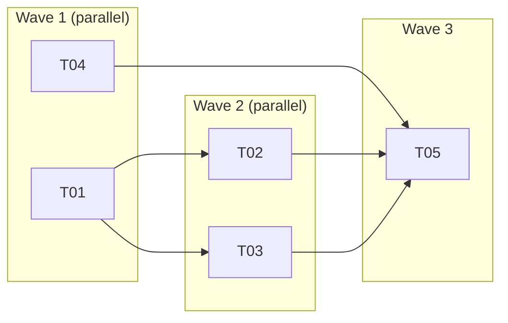

# Orchestrator

The Orchestrator wires atomic workflows into a pipeline, manages task lifecycle state, and handles error recovery. It coordinates which agent runs when, with what model, and which gates must pass. It does not do the work. It watches that it flows.

---

## Two Levels

| Level | Command | Scope |
|-------|---------|-------|
| Task | `/run-task` | Drives one task through the full pipeline |
| Sprint | `/run-sprint` | Runs all sprint tasks, respecting dependencies, handling failures |

---

## The Pipeline

```
Plan → Review Plan → [loop max 3] → Implement → Review Code → [loop max 3] → Validate → Approve → Writeback → Commit
```

Each phase is a configurable unit with defined properties:

| Phase | Agent | Model | Produces | Gate |
|-------|-------|-------|----------|------|
| Plan | Engineer | sonnet | PLAN.md | — |
| Review Plan | Supervisor | opus | PLAN_REVIEW.md | Verdict extraction |
| Implement | Engineer | sonnet | PROGRESS.md | Tests pass, build succeeds, lint clean |
| Review Code | Supervisor | opus | CODE_REVIEW.md | Verdict extraction |
| Validate | QA Engineer | opus | VALIDATION_REPORT.md | Acceptance criteria met |
| Approve | Architect | opus | ARCHITECT_APPROVAL.md | — |
| Writeback | System | — | — | Knowledge updates persisted |
| Commit | Engineer | haiku | Commit | — |

Revision loops run up to `max_iterations` (default 3). When the loop exhausts, the Orchestrator escalates to the user. Continuing past an unresolved problem is never acceptable.

---

## Bug Fix Pipeline

Bugs use severity-based shortcuts:

| Severity | Pipeline | Skipped phases |
|----------|----------|--------------|
| Critical | Implement → Review Code → Commit | Plan, Plan Review, Approve |
| Major | Plan → Implement → Review Code → Approve → Commit | Plan Review |
| Minor | Full pipeline | None |

---

## Sprint Execution Modes

### Sequential (default)

```
T01 → T02 → T03 → T04 → T05
```

One task at a time. One worktree. No merge complexity.

### Wave-Parallel (recommended)



Tasks within a wave run simultaneously in separate worktree branches. After a wave completes, branches merge into the sprint branch. The next wave starts from the merged state.

### Full-Parallel

All tasks start immediately in separate worktrees. Merge in topological order after all complete. Maximum speed, maximum merge conflict risk.

---

## Wave Computation

The sprint runner computes waves from the dependency graph:

1. Parse dependency edges from task manifests
2. Compute topological sort
3. Assign each task a **depth** (longest path from any root)
4. Group tasks by depth — these are the waves
5. Within each wave, order by task number

```
Wave 0 (depth 0): T01, T04    — no dependencies
Wave 1 (depth 1): T02, T03    — depend on wave 0
Wave 2 (depth 2): T05, T06    — depend on wave 1
```

---

## Dynamic Rescheduling

When a task fails, the sprint does not necessarily halt:

- Independent tasks continue.
- Dependent tasks are blocked.
- The human is notified with the failure details and which tasks are blocked.
- When the human resolves the failed task, the sprint resumes from where it stopped.

```
T01: ✅ Complete
T02: ✅ Complete
T03: ❌ Failed (implementation phase, iteration 2)
T04: 🔵 In Progress (independent of T03)
T05: ⏸️ Blocked by T03
```

---

## Merge Strategy

```
Fast-forward merge → success: proceed
  ↓ fail
3-way merge → success (no conflicts): proceed
  ↓ conflict
Trivial conflict (import ordering, adjacent lines) → auto-resolve, run tests
  ↓ non-trivial
Escalate to human — preserve all worktrees, report conflicting files
```

---

## Event Emission

Every phase emits a structured event to the store:

```json
{
  "eventId": "20260415T141523000Z_ACME-S02-T03_engineer_implement",
  "taskId": "ACME-S02-T03",
  "sprintId": "S02",
  "role": "Engineer",
  "action": "/implement",
  "phase": "implement",
  "iteration": 1,
  "startTimestamp": "2026-04-15T14:00:00.000Z",
  "endTimestamp": "2026-04-15T14:15:23.000Z",
  "durationMinutes": 15,
  "model": "sonnet",
  "verdict": null
}
```

These events feed the cost report, the retrospective, and the self-enhancement flywheel.

---

## Error Recovery

| Failure | Detection | Recovery | Fallback |
|---------|-----------|----------|----------|
| Test failure | Test command exits non-zero | Pass error to Engineer, retry once | Escalate |
| Build failure | Build command exits non-zero | Pass error to Engineer, retry once | Escalate |
| Syntax error | Syntax check exits non-zero | Auto-fix in Engineer workflow | Escalate |
| Verdict: Revision Required | Verdict extraction | Enter revision loop (up to max) | Escalate after max |
| No output from subagent | Timeout or empty response | Retry once with simplified prompt | Escalate |
| Git hook failure | Commit exits non-zero | Diagnose, fix, new commit | Escalate |
| Merge conflict | Git merge exits non-zero | Escalate to human | — |

Rule: retry mechanical failures once. Escalate judgment failures after the loop limit.

---

## Pipeline Customization

Customize through `.forge/config.json`:

```json
{
  "pipeline": {
    "skipPhases": ["review-plan"],
    "maxReviewIterations": 1
  }
}
```

Or add phases:

```json
{
  "pipeline": {
    "additionalPhases": [
      {
        "name": "security-review",
        "after": "review-implementation",
        "agent": "supervisor",
        "workflow": "security_review.md",
        "model": "opus"
      }
    ]
  }
}
```

Or define a named pipeline via `/forge:add-pipeline` and assign it to specific tasks.

---

## Resource Constraints

```json
{
  "sprint": {
    "execution": {
      "mode": "wave-parallel",
      "maxConcurrentAgents": 3,
      "modelLimits": { "opus": 2, "sonnet": 4 }
    }
  }
}
```

If a wave has 5 tasks but `maxConcurrentAgents` is 3, the runner starts 3 and queues 2.

---

## Resume Semantics

`/run-sprint` is idempotent. Running it on a partially-complete sprint:

1. Detects existing worktree → skips setup
2. Reads task store → identifies completed, failed, and pending tasks
3. Skips completed tasks
4. Retries failed tasks (or skips if the human has not resolved the blocker)
5. Runs pending tasks in dependency order
6. Reports what was skipped and why