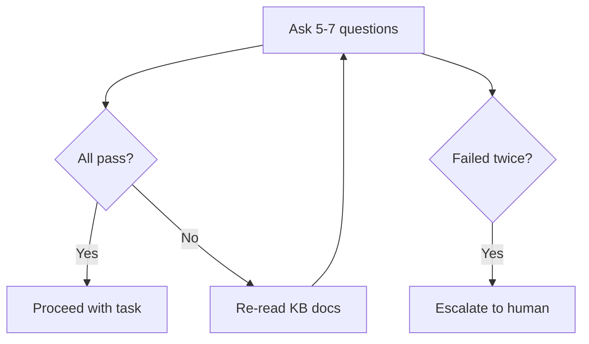

# Quiz Agent

The quiz verifies that an agent has correctly loaded and understood the project's knowledge base before beginning a high-stakes task. It is a safety gate, not a formality.

---

## When to Use It

The quiz runs before:
- Schema changes
- Database migrations
- Significant refactors
- Deployment steps
- Release engineering

It is invoked inline by other workflows — not as an orchestrator task phase.

---

## How It Works

### Questions

5–7 project-specific questions generated during `/forge:init`. Each question:
- References a specific fact from the project KB (not common knowledge)
- Has an unambiguous correct answer findable in the KB
- Covers at least three of: stack conventions, architecture, domain entities, process, constraints

Questions avoid yes/no format. They use "what", "where", "name", "describe" forms.

### Pass Criteria

All questions answered correctly and specifically. Vague answers fail:

- ✅ "The project uses Django 4.2 with PostgreSQL 15, and migrations are managed through `python manage.py makemigrations`"
- ❌ "It uses some kind of database thing"

### Fail Action

1. Agent re-reads the KB docs listed in the quiz workflow
2. Agent retries the quiz
3. If the agent fails twice, it escalates to the user before beginning the task

The user decides whether to proceed despite the knowledge gap, or to update the KB first.

---

## KB Patching

When the user corrects a wrong answer during the quiz, Forge patches the knowledge base immediately. The quiz doubles as a guided session for improving the KB.

---

## Generation

Questions are generated during `/forge:init` by reading:
- `{KB_PATH}/architecture/` — all .md files
- `{KB_PATH}/business-domain/` — all .md files
- `{KB_PATH}/stack-checklist.md`
- `{KB_PATH}/MASTER_INDEX.md`

The generated quiz is project-specific. Generic questions about Forge or Claude Code are not appropriate unless the project's KB explicitly documents them as project conventions.

---

## No Token Reporting

The quiz does not include token reporting or event emission. It runs inline within other workflows, not as a standalone task phase.