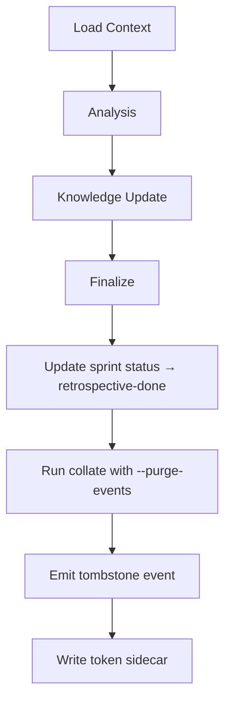

# Retrospective

The retrospective closes a sprint by reviewing learnings, updating the knowledge base, and improving workflows. It is the most important step in the self-improvement cycle.

---

## Who Drives It

Architect persona.

---

## How It Works

### 1. Load Context

Reads:
- All task manifests for the sprint
- All event logs (including token usage)
- All retrospective notes gathered during the sprint

### 2. Analysis

The Architect identifies:
- **Total sprint cost** — tokens and USD
- **Bottleneck tasks** — high iteration counts or long duration
- **Common failure modes** — patterns in review feedback

### 3. Knowledge Update

Updates based on what the sprint revealed:
- Architecture docs — lessons learned
- Domain docs — new entities or changed relationships
- Stack checklist — new verification steps from recurring review feedback
- Workflow improvement proposals — based on pattern analysis

### 4. Finalize

- Writes `SPRINT_RETROSPECTIVE.md`
- Updates sprint status to `retrospective-done` via store
- Runs `collate {sprintId} --purge-events` — generates COST_REPORT.md from events, then deletes raw event files
- Emits a tombstone event (the only event remaining after purge)
- Writes a token usage sidecar

---

## Pattern Signals

The Architect watches for these signals:

| Signal | Meaning |
|--------|---------|
| Many plan revision loops | Acceptance criteria are underspecified |
| Many code review loops | Engineer deviated from plan |
| Recurring review feedback themes | Candidate for stack-checklist |
| Recurring bug root causes | Candidate for preventive checks |
| Cross-task merge conflicts | Missing dependency edge in sprint plan |

---

## `[?]` Marker Review

`[?]` markers in the knowledge base are reviewed during retrospective:

- Confirmed entries are cleaned up (marker removed)
- Patterns appearing in 2+ sprints are promoted to the stack checklist
- Outdated entries are removed

---

## Event Purging

The `--purge-events` flag in collate is the mechanism that consolidates event data:

1. All event files for the sprint are read
2. COST_REPORT.md is generated with per-task, per-role, and revision-waste sections
3. Bug cost data is embedded in bug INDEX.md files
4. All raw event files are deleted
5. A tombstone event is written as the only remaining event

COST_REPORT.md is the durable record. Raw events are not retained after retrospective close.