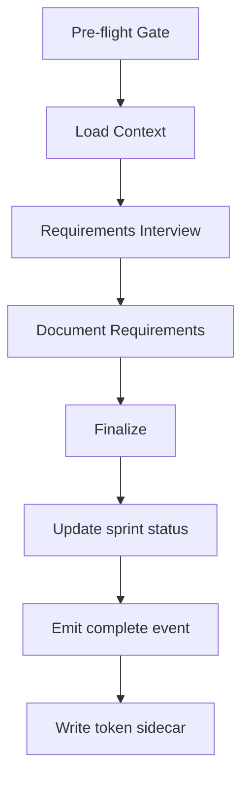

# Sprint Intake

Sprint intake captures requirements via a structured interview. The Product Manager persona conducts the interview. It does not proceed until the requirements are unambiguous.

---

## Who Drives It

Product Manager persona.

---

## How It Works

### 1. Pre-flight Gate Check

Runs `/cost` to verify token reporting is available. If it fails, the workflow notes that estimates will be used instead of reported data.

### 2. Load Context

Reads:
- Project vision and current MASTER_INDEX.md
- Pending feature requests and bug reports
- Architecture/stack.md for technical context

### 3. Requirements Interview

The Product Manager conducts a structured interview. It captures:
- **Objectives** — what this sprint must deliver
- **Constraints** — time, scope, technical limits
- **Deliverables** — concrete outputs with acceptance criteria
- **Success criteria** — measurable conditions for sprint completion
- **Edge cases** — boundary conditions and error paths
- **Out-of-scope** — what is explicitly excluded

The Product Manager clarifies ambiguous requirements through iterative questioning. Vague requirements are not accepted.

### 4. Document Requirements

Produces `SPRINT_REQUIREMENTS.md` with:
- Structured requirements with acceptance criteria
- Edge cases and error scenarios
- Explicit out-of-scope items
- Mapping to existing features if applicable

### 5. Finalize

- Updates sprint status to `planning` via store
- Emits a complete event to the store
- Writes a token usage sidecar (reported or placeholder with nulls)

---

## Output

`SPRINT_REQUIREMENTS.md` — the single document that feeds `/sprint-plan`.

---

## Important Rules

- The Product Manager persona is loaded from `.forge/personas/product-manager.md` as the first step
- Token reporting is mandatory — even if `/cost` fails, a sidecar with null fields is written
- The complete event must include the `eventId` passed by the orchestrator