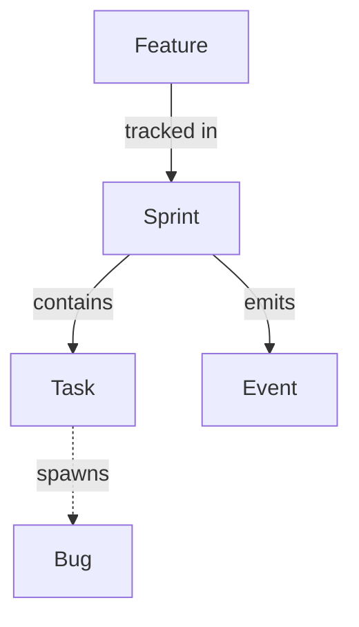
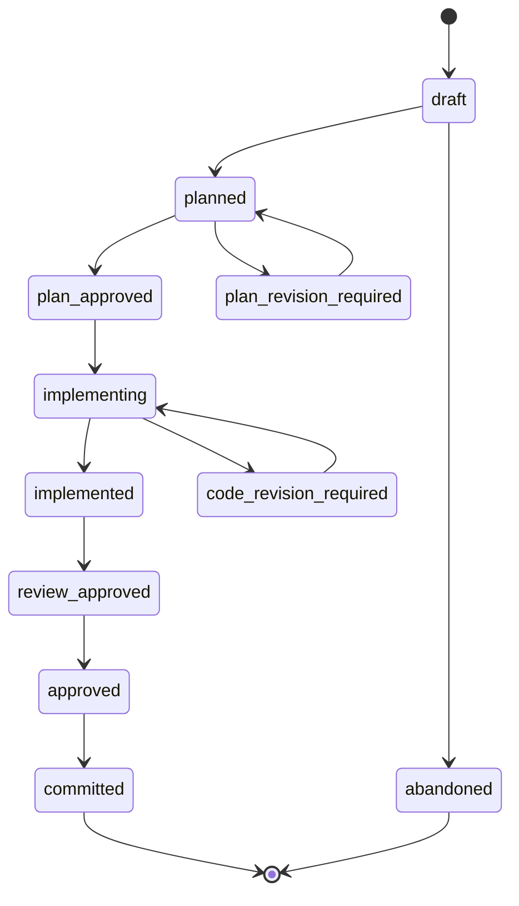
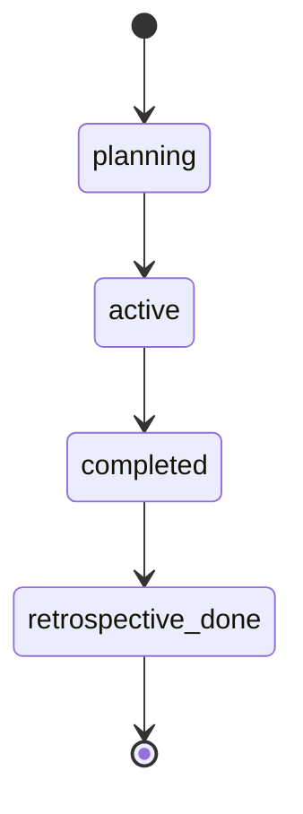
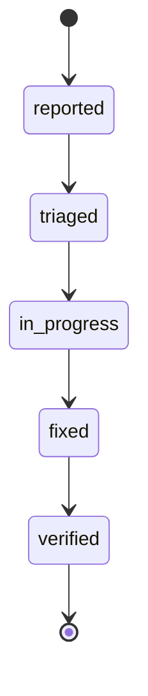
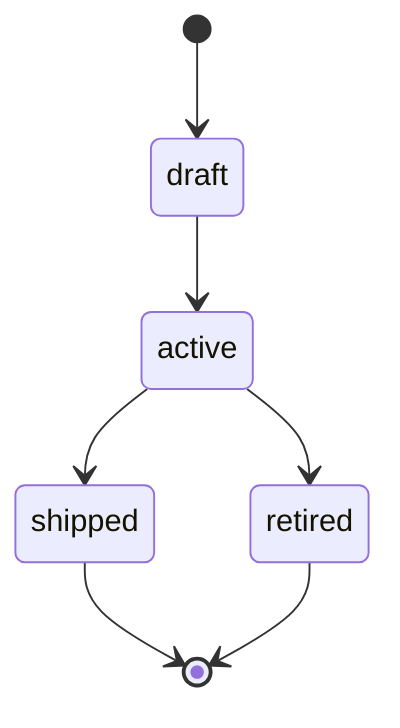

# Store

The Forge store is a JSON file-based persistence layer for all project entities. It lives in `.forge/store/` and is managed exclusively through `store-cli.cjs`.

---

## Data Model

Five entity types, each stored as flat JSON files:

| Entity | ID Field | Directory | Description |
|--------|----------|-----------|-------------|
| Sprint | `sprintId` | `sprints/` | Time-boxed execution cycle |
| Task | `taskId` | `tasks/` | Atomic work item within a sprint |
| Bug | `bugId` | `bugs/` | Defect record |
| Event | `eventId` | `events/{sprintId}/` | Phase execution record |
| Feature | `id` | `features/` | Vertical slice of the project |



---

## Directory Structure

```
.forge/store/
├── sprints/
│   ├── FORGE-S01.json
│   └── FORGE-S02.json
├── tasks/
│   ├── FORGE-S01-T01.json
│   └── FORGE-S01-T02.json
├── bugs/
│   ├── FORGE-BUG-001.json
│   └── HELLO-B02.json
├── events/
│   ├── FORGE-S01/
│   │   ├── 20260415T141523Z_FORGE-S01-T01_engineer_implement.json
│   │   └── _20260415T141523Z_FORGE-S01-T01_engineer_implement_usage.json
│   └── FORGE-S02/
├── features/
│   └── FEAT-001.json
└── COLLATION_STATE.json
```

Events are nested under their sprint directory. Sidecar files (usage data) are prefixed with `_` and live alongside their canonical events.

---

## Status Transitions

Status changes follow strict transition rules. The store CLI enforces these by default. Use `--force` to bypass (with a warning).

### Task



### Sprint



### Bug



### Feature



Failed states (`blocked`, `escalated`, `plan-revision-required`, `code-revision-required`) can be entered from any non-terminal state.

Terminal states (`committed`, `abandoned`, `retrospective-done`, `verified`, `shipped`, `retired`) have no outgoing transitions.

---

## Sidecar Pattern

Token usage data is written as ephemeral sidecar files, then merged into the canonical event:

1. A phase subagent completes and writes a sidecar: `_{eventId}_usage.json`
2. The Orchestrator runs `merge-sidecar` after the phase completes
3. Sidecar fields (inputTokens, outputTokens, cacheReadTokens, cacheWriteTokens, estimatedCostUSD) are merged into the canonical event
4. The sidecar file is deleted

This separates phase execution (which writes the canonical event) from token reporting (which writes the sidecar). The two can run at different times without conflict.

---

## Store Custodian Skill

The Store Custodian skill is the sole authorized gateway for store writes. Agent workflows write to the store through `store-cli.cjs`, which validates every write against the schema and enforces transition rules.

Direct file writes to `.forge/store/` are blocked by the `validate-write.js` hook. This prevents agents from bypassing validation and transition enforcement.

---

## Schema Validation

Every entity write is validated against JSON schemas in `.forge/schemas/`. Schemas are resolved in this order:

1. Project-installed schemas (`.forge/schemas/`)
2. In-tree source schemas (`forge/schemas/`)
3. Plugin-installed schemas (`$FORGE_ROOT/schemas/`)

If a schema file is not found, the CLI falls back to a minimal required-fields check.

---

## Ghost File Detection

When an event file's filename does not match its internal `eventId`, the store detects the mismatch and auto-renames the file before writing. This prevents stale filenames from accumulating after event updates.