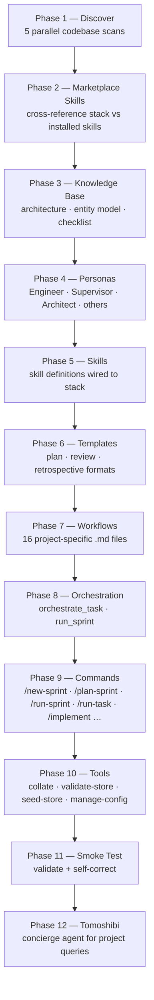

# /forge:init

**Category:** Forge plugin command
**Run from:** Any project directory

---

## Purpose

Bootstraps a complete, project-specific SDLC instance from the codebase in the current directory. Runs 12 automated phases to produce a knowledge base, agent personas, workflows, templates, tools, slash commands, and the Tomoshibi concierge — all tailored to the actual project, not a template.

Run once per project. Use `/forge:rebuild` to refresh individual categories later.

---

## Invocation

```bash
/forge:init                # run all phases
/forge:init 6              # resume from phase 6
/forge:init orchestration   # resume from the named phase
/forge:init --migrate      # migrate a legacy store to current Forge format
```

---

## Phases



| Phase | Reads | Produces |
|-------|-------|---------|
| 1 Discover | package.json, models, routes, tests, CI config | `.forge/config.json` |
| 2 Marketplace Skills | Installed plugins, recommendation mapping | `config.installedSkills` |
| 3 Knowledge Base | Discovery context | `engineering/architecture/`, `entity-model.md`, `stack-checklist.md` |
| 4 Personas | Meta-personas + KB | `.forge/personas/` |
| 5 Skills | Meta-skills + KB | `.forge/skills/` |
| 6 Templates | Meta-templates + KB | `.forge/templates/` |
| 7 Workflows | Meta-workflows + KB + personas | `.forge/workflows/` (16 files) |
| 8 Orchestration | `meta-orchestrate.md` + generated workflows | `orchestrate_task.md`, `run_sprint.md` |
| 9 Commands | Generated workflows | `.claude/commands/` |
| 10 Tools | Tool specs + config | `engineering/tools/` |
| 11 Smoke Test | All generated artifacts | Validation report; self-corrects once |
| 12 Tomoshibi | Config + KB | `.forge/agents/tomoshibi.md` (project-local) |

---

## What gets generated

```
.forge/
  config.json             Project configuration (stack, paths, pipeline, mode)
  workflows/              16 project-specific agent workflows + orchestrator
  personas/               Agent identity files (Engineer, Supervisor, Architect, etc.)
  skills/                 Skill definitions wired to your stack
  templates/              Plan, review, retrospective document templates
  schemas/                 JSON validation schemas for the store
  store/                   Empty JSON store directories (sprints, tasks, bugs, events, features)
  cache/                   Persona packs and context packs
engineering/
  architecture/           stack · processes · database · routing · deployment docs
  business-domain/        entity-model.md
  stack-checklist.md      Initial review criteria
  MASTER_INDEX.md         KB scaffold
  tools/                  collate · validate-store · seed-store · manage-config
.claude/commands/         All slash commands (project-scoped)
```

---

## After init

Generated docs include confidence ratings and `[?]` markers:

```markdown
<!-- AUTO-GENERATED by /forge:init — confidence: 72%
     Lines marked [?] need human verification. -->
```

Review `engineering/` before the first sprint. Use `/quiz` to correct errors interactively. See [Onboarding an existing project](../../existing-project.md) for a full walkthrough.

After the quiz session, rebuild workflows so they reflect the corrected KB:
```bash
/forge:rebuild workflows
```

---

## Gate checks

- Smoke test (Phase 11) validates structural completeness, referential integrity, and tool execution.
- Self-corrects once per failing component; reports remaining failures if self-correction is unsuccessful.
- Config is validated against `sdlc-config.schema.json` after Phase 1.

---

## Related commands

| If you want to… | Run |
|---|---|
| Refresh workflows after KB enrichment | [`/forge:rebuild workflows`](rebuild.md) |
| Add a new pipeline | [`/forge:add-pipeline`](add-pipeline.md) |
| Check for drift after codebase changes | [`/forge:health`](health.md) |
| Ask about project status | [`/forge:ask`](ask.md) |