# /forge:quiz-agent

Verify that the active agent has loaded and understood the project knowledge base.

## What it does

Runs a short factual quiz before high-stakes tasks — schema changes, migrations, release engineering, significant refactors. If the agent fails, it re-reads the knowledge base and retries. If it fails twice, it escalates to you.

## Invocation

```
/forge:quiz-agent
/forge:quiz-agent FORGE-S01-T03
```

The optional argument is a task ID, which the agent uses to include task context in its responses.

## What happens

1. **Generate questions.** The agent reads the project's architecture docs, business-domain docs, stack-checklist, and MASTER_INDEX.md. It produces 5–7 questions covering at least 3 of: stack conventions, architecture, domain entities, process, and constraints.
2. **Evaluate.** Each answer is scored as PASS or FAIL.
3. **Pass.** If all questions pass, the agent proceeds with the task.
4. **Fail.** The agent re-reads the listed KB docs and retries the quiz.
5. **Escalate.** If the agent fails twice, it stops and asks you to intervene before beginning the task.

```mermaid
flowchart TD
    Q["5-7 project-specific\nquestions"] --> E{Evaluate}
    E -->|All pass| P["Proceed with task"]
    E -->|Any fail| R["Re-read KB docs"]
    R --> E2{Retry quiz}
    E2 -->|All pass| P
    E2 -->|Any fail| ESC["Escalate to human"]

    style ESC fill:#e74c3c,color:#fff
    style P fill:#2ecc71,color:#fff
```



The quiz is invoked inline by other workflows — it is not a pipeline phase. It does not emit events or write token reports.

## When to use

- Before schema changes
- Before database migrations
- Before release engineering
- Before significant refactors

## Related

- [`/forge:health`](health.md) — check for KB drift and gaps
- [`/forge:calibrate`](calibrate.md) — detect and fix drift