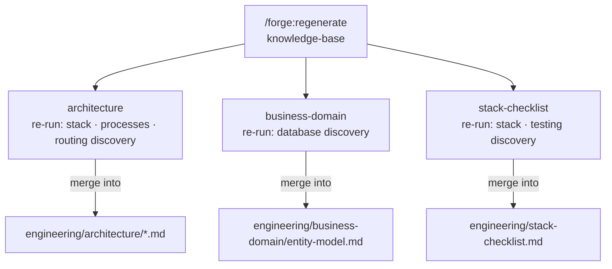
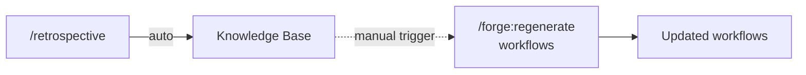

# /forge:regenerate

**Category:** Forge plugin command
**Run from:** Any Forge-initialised project directory

---

## Purpose

Re-runs generation phases to refresh project artifacts from the current state of the plugin meta-definitions and knowledge base. Different categories have different modes — full rebuild for deterministic targets, merge-only for the knowledge base.

---

## Invocation

```bash
/forge:regenerate                              # default: workflows + commands + templates + personas + skills
/forge:regenerate workflows                    # atomic workflows + orchestration
/forge:regenerate workflows plan_task           # single workflow file
/forge:regenerate workflows:plan_task           # same — colon form (from migration entries)
/forge:regenerate personas                     # all persona files
/forge:regenerate personas engineer            # single persona file
/forge:regenerate skills                       # all skill files
/forge:regenerate skills engineer              # single skill file
/forge:regenerate commands                     # slash command wrappers
/forge:regenerate templates                    # document templates
/forge:regenerate templates PLAN_TEMPLATE      # single template file
/forge:regenerate knowledge-base               # all three KB sub-targets (merge mode)
/forge:regenerate knowledge-base architecture
/forge:regenerate knowledge-base:architecture  # colon form (from migration entries)
/forge:regenerate knowledge-base business-domain
/forge:regenerate knowledge-base stack-checklist
/forge:regenerate tools                        # engineering/tools/
```

---

## Fast-mode awareness

Regenerate respects `.forge/config.json` `mode`. In fast mode:
- Only materialized files are regenerated. Stubs are skipped with a message.
- Stubs self-materialize on first use — nothing is lost.
- Regenerate does NOT write `mode`. Mode promotion is owned by `/forge:config mode full`.

| | Full mode | Fast mode |
|---|---|---|
| Personas | All meta-personas regenerated | Only materialized personas regenerated |
| Skills | All meta-skills regenerated | Only materialized skills regenerated |
| Workflows | Full rebuild + orchestration | Only materialized workflows; orchestration skipped |
| Templates | Full rebuild | Only materialized templates regenerated |
| Commands | Full rebuild | Full rebuild (commands are always present in fast mode) |
| Knowledge base | Merge mode (unchanged) | Merge mode (unchanged) |

---

## Categories

### `personas` — full rebuild or single file

Re-generates `.forge/personas/` from meta-persona definitions and the current knowledge base.

**When to run:** After KB enrichment that should change how personas behave; after adding custom review criteria; after a Forge update that changes meta-persona definitions.

**Does NOT touch:** `.forge/workflows/`, `.claude/commands/`, `.forge/config.json`, knowledge base.

---

### `skills` — full rebuild or single file

Re-generates `.forge/skills/` from meta-skill templates and project config.

**When to run:** After a Forge update that adds or changes skill definitions.

---

### `workflows` — full rebuild or single file

Re-generates `.forge/workflows/` from meta-workflow definitions and the current knowledge base. Covers atomic workflows and orchestration.

**When to run:** After KB enrichment across several sprints; after adding a custom pipeline via `/forge:add-pipeline`; after a Forge update that changes meta-workflow definitions.

**Does NOT touch:** `.claude/commands/`, `.forge/config.json`, knowledge base.

---

### `commands` — full rebuild

Re-generates `.claude/commands/` slash command wrappers from the current `.forge/workflows/`. Each command is a thin wrapper that delegates to its workflow.

**When to run:** When workflow files have been renamed; when a new workflow was added and its command wrapper is missing; when a command wrapper points to a missing workflow.

**Does NOT touch:** Custom commands in `engineering/commands/` or any file not in the generated command list.

---

### `templates` — full rebuild or single file

Re-generates `.forge/templates/` from meta-template definitions and the current knowledge base.

**When to run:** After significant KB changes that should be reflected in plan/review document formats.

---

### `tools` — full rebuild

Re-generates `engineering/tools/` from tool specs and `config.json`. Fully deterministic — safe to rebuild from scratch.

**When to run:** After a new tool spec is added; if the project switches primary language.

---

### `knowledge-base` — merge mode

**This is not a full rebuild.** The KB accumulates writeback across sprints — overwriting it destroys that knowledge. Instead, re-runs scoped discovery prompts and merges only new content into existing docs.



**Merge rules (all KB sub-targets):**
- Additive only — existing sections are never removed or overwritten
- `[?]` markers updated if the re-scan can now confirm them
- Contradictions flagged `[CONFLICT]` for human review — not auto-resolved
- New entities marked `[NEW]` for team review
- Vanished entities flagged `[NOT FOUND IN SCAN]`, not deleted

**Sub-targets:**

| Sub-target | Discovery re-run | Merge target | When to use |
|---|---|---|---|
| `architecture` | stack + processes + routing | `engineering/architecture/*.md` | New subsystems, services, or integrations added |
| `business-domain` | database | `entity-model.md` | New ORM models or schema tables added |
| `stack-checklist` | stack + testing | `stack-checklist.md` | New libraries adopted mid-project |

---

## Common behaviour (all categories)

- Shows a unified diff between current and regenerated content before writing
- Prompts before overwriting each file — never auto-replaces
- Checks the generation manifest for user modifications; warns before overwriting modified files
- Knowledge base files are always inputs, never outputs (except for `knowledge-base` sub-targets)

---

## Post-regeneration

After regeneration, Forge rebuilds:
- **Persona pack** (`.forge/cache/persona-pack.json`) — compact persona/skill references for subagent prompts
- **Context pack** (`.forge/cache/context-pack.md`, `.forge/cache/context-pack.json`) — architecture summary for subagent prompts

Then runs a structure verification:
```bash
node "$FORGE_ROOT/tools/check-structure.cjs" --path .
```

---

## KB / workflow decoupling

The KB updates automatically via retrospective writeback. The generated workflows do not — they are a snapshot that only changes on explicit regeneration.



Run `regenerate workflows` every few sprints, or after a retrospective that revealed significant new patterns.

---

## When to run what

| Situation | Command |
|---|---|
| After adding a custom pipeline | `regenerate workflows` |
| After a significant retrospective | `regenerate workflows` |
| Health detects orphaned entities | `regenerate knowledge-base business-domain` |
| Health detects new subsystems | `regenerate knowledge-base architecture` |
| Health detects new libraries | `regenerate knowledge-base stack-checklist` |
| Health detects stale personas | `regenerate personas` |
| Health detects stale skills | `regenerate skills` |
| New tool spec added | `regenerate tools` |
| After Forge plugin update | Use `/forge:update` — it handles regeneration automatically |

---

## Related commands

| Command | Purpose |
|---|---|
| [`/forge:health`](health.md) | Detect what needs regenerating |
| [`/forge:update`](update.md) | Post-plugin-update regeneration (version-aware) |
| [`/forge:add-pipeline`](add-pipeline.md) | Add a pipeline (then run `regenerate workflows`) |
| [`/forge:materialize`](materialize.md) | Fill stubs from fast mode |