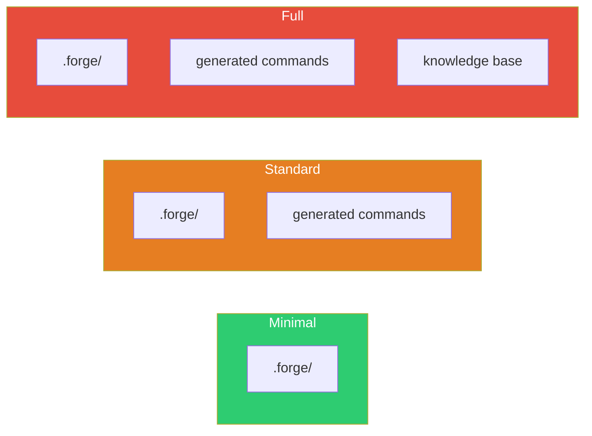

# /forge:remove

Remove Forge artifacts from the current project.

## What it does

Removes Forge-generated files at three levels of granularity. Nothing is deleted until you confirm explicitly. The plugin itself is unaffected — only project artifacts are removed.

## Invocation

```
/forge:remove
```

The command is interactive. It presents options and requires confirmation.

## Removal levels

| Level | Removes | Keeps |
|-------|---------|-------|
| **Minimal** | `.forge/` (config, workflows, templates, store) | Knowledge base, generated commands |
| **Standard** | `.forge/` + generated commands | Knowledge base |
| **Full** | `.forge/` + commands + knowledge base | Nothing |



## What happens

1. **Inventory.** Checks which Forge directories exist in the project.
2. **Present options.** Shows the three removal levels with descriptions.
3. **KB confirmation** (full only). If you choose full removal, the command asks you to type `delete {KB_PATH}` explicitly. If you type anything else, it downgrades to standard removal.
4. **Final confirmation.** Lists every file that will be deleted. You must type `confirm` to proceed.
5. **Execute.** Removes only the confirmed items using targeted commands.
6. **Close.** Confirms completion. Reminds you that `/forge:init` reinstalls Forge in this project.

## After removal

- To reinstall Forge: `/forge:init`
- To uninstall the plugin: `/plugin uninstall forge`

## Related

- [`/forge:init`](init.md) — install Forge in a project