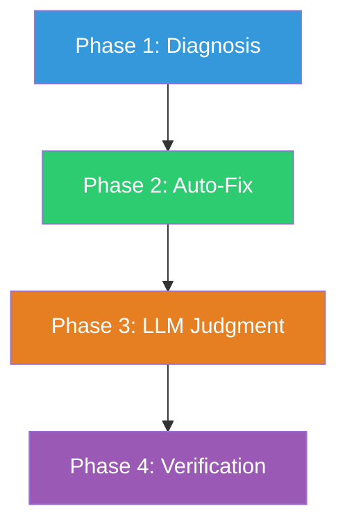

# /forge:store-repair

Diagnose and repair corrupted store records.

## What it does

Runs a four-phase repair process: diagnose all errors, auto-fix what can be fixed deterministically, apply LLM judgment (with your approval) to the rest, then verify the store is clean.

## Invocation

```
/forge:store-repair
/forge:store-repair --dry-run
```

## Flags

| Flag | Purpose |
|------|---------|
| `--dry-run` | Preview all changes without writing anything |

## The four phases



### Phase 1: Diagnosis

Runs the deterministic validator. Categorizes each error:

| Category | Example | Auto-fixable? |
|----------|---------|:------------:|
| `missing-required` | `sprintId: null` on a sprint | Yes |
| `type-mismatch` | `iteration: "1"` instead of `1` | Yes |
| `invalid-enum` | `status: "in-progress"` on a bug | No |
| `undeclared-field` | `priority: "high"` on a task | No |
| `orphaned-fk` | taskId pointing to deleted task | No |
| `filename-mismatch` | Event filename != eventId | Yes |
| `minimum-violation` | `iteration: 0` | Yes |
| `orphan-directory` | Sprint dir with no sprint record | No |
| `stale-path` | `path` pointing to nonexistent dir | No |

### Phase 2: Auto-Fix

Fixes all deterministic errors in one pass: backfills missing required fields, coerces types, renames mismatched event files. Reports each fix.

### Phase 3: LLM Judgment

For errors that need judgment, reads the corrupted record, determines the correct value, and presents the proposed fix with reasoning. You approve or decline each fix.

Common misspelling mappings applied automatically:

| Common form | Forge canonical |
|-------------|----------------|
| `in-progress` (sprint) | `active` |
| `done`, `finished` (sprint) | `completed` |
| `in-progress` (task) | `implementing` |
| `in-review` (task) | `review-approved` |
| `open` (bug) | `reported` |
| `high` severity | `critical` |
| `medium` severity | `major` |

### Phase 4: Verification

Re-runs the validator. Reports PASS or FAIL with remaining error counts.

## Hard rules

- All repairs go through `store-cli.cjs`. Never writes store files directly.
- Never deletes data without your confirmation.
- Never skips Phase 4 verification.
- Prefers corrections that retain more original data.

## Related

- [`/forge:store-query`](store-query.md) — search the store
- [`/forge:migrate`](migrate.md) — migrate a pre-Forge store to Forge format