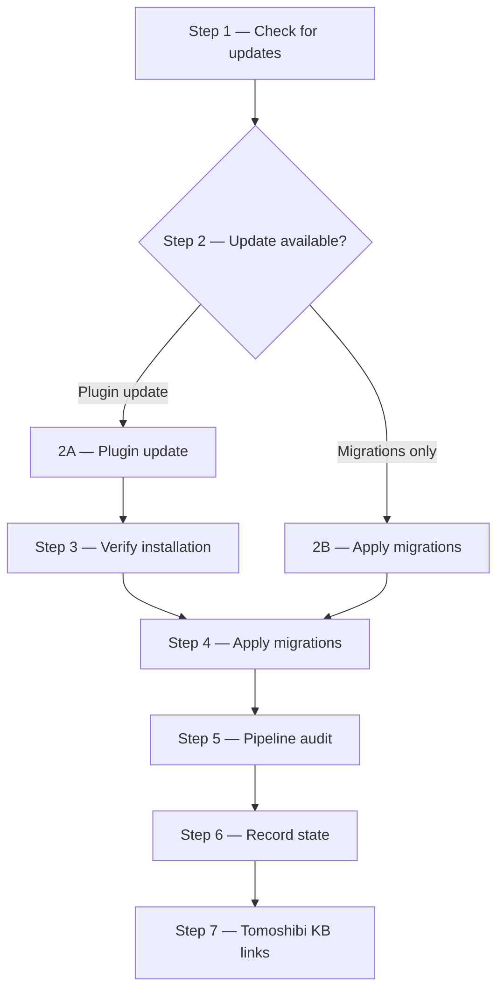

# /forge:update

**Category:** Forge plugin command
**Run from:** Any Forge-initialised project directory

---

## Purpose

Single entry point for updating Forge. Checks GitHub for new versions, shows what changed, guides you through the install, applies migrations to generated artifacts, runs a pipeline audit, and refreshes Tomoshibi's KB links.

Run this after installing or upgrading Forge (`/plugin install forge@skillforge` for stable, `/plugin install forge@forge` for canary).

---

## Invocation

```bash
/forge:update                    # auto-detect versions from cache
/forge:update --from 0.2.0       # override baseline version (if cache is missing)
/forge:update --skip-check       # skip remote version check — only apply pending migrations
```

---

## Steps

Forge update runs 7 steps:



### Step 1 — Check for updates

Reads the local plugin version and fetches the remote manifest from GitHub. Determines whether an update is available and whether any pending migrations exist for this project.

If the network is unavailable, proceeds with local version only.

### Step 2A — Plugin update available

Shows the update summary: what changed between versions, what regeneration targets will run, and whether any breaking changes require manual steps.

Guides you through the install via the plugin manager. Waits for your confirmation that the install completed.

### Step 2B — Project migration pending

Reached when the plugin is already current but the project's generated artifacts lag behind. Shows what migrations need to be applied.

### Step 3 — Verify installation

After you confirm the install, re-reads the plugin version to verify the update succeeded. Re-derives `FORGE_ROOT` in case the cache path changed.

### Step 4 — Apply migrations

Walks the migration chain from your baseline version to the current version. Aggregates all regeneration targets across every step in the path.

**Regeneration order:**

| Order | Target | Depends on |
|-------|--------|-----------|
| 1 | tools | — |
| 2 | workflows | — |
| 3 | templates | — |
| 4 | personas | — |
| 5 | commands | workflows |
| 6 | knowledge-base sub-targets | — |

After regeneration, runs a structure check and refreshes the `calibrationBaseline` in config.

### Step 5 — Pipeline audit

Scans for retired files, legacy fields, missing workflow fields, and configuration drift. Presents a consolidated list of findings with four options:

| Choice | What happens |
|--------|-------------|
| **[Y]** Apply required | Applies required items, skips optional decorations |
| **[a]** Apply all | Applies everything including optional decorations |
| **[r]** Review individually | Walks through each item one at a time |
| **[n]** Skip all | Skips everything, lists what was skipped |

**What the audit checks:**
- Retired command and workflow files from old Forge versions
- Legacy `model:` frontmatter in workflow files
- Retired command names in pipeline configurations
- Missing `workflow` field on custom pipeline phases
- Missing `paths.customCommands` config key
- Missing `.gitignore` entry for `.forge/store/events/`
- Missing persona symbol lines in custom commands

### Step 6 — Record state

Updates `paths.forgeRoot` in config to point to the current plugin directory. Writes the update-check cache with the completed migration baseline.

Prints a summary: what was updated, what was regenerated, what the audit found.

### Step 7 — Tomoshibi KB links

Invokes the `forge:refresh-kb-links` skill to ensure all agent instruction files have current links to the knowledge base and workflow entry points.

---

## Migration manifest

`migrations.json` maps each `from` version to a migration step:

```json
{
  "0.2.0": {
    "version": "0.3.0",
    "notes": "Pluggable pipeline routing, manage-config tool, extended regenerate.",
    "regenerate": ["tools", "workflows"],
    "breaking": false,
    "manual": []
  }
}
```

If upgrading across multiple versions (e.g., 0.2.0 → 0.4.0), the command walks the chain and aggregates all `regenerate` targets and `manual` steps.

---

## Model-alias auto-suppression

When a migration mentions custom `model` overrides as a manual step, the update command checks your config automatically. If all `model` values in your pipelines are standard Forge aliases (`sonnet`, `opus`, `haiku`), the manual step is a false positive and is removed. You only see the manual step if you have non-standard model values.

---

## On failure / blockers

| Situation | Behaviour |
|---|---|
| `migratedFrom` not in cache | Ask user for baseline version; or pass `--from <version>` |
| No migration path found | Warn; recommend `regenerate workflows tools` as safe fallback |
| Breaking changes — manual steps not confirmed | Do not run regeneration until confirmed |
| Regeneration fails mid-run | Report which target failed; remaining targets not run |
| Cross-distribution downgrade detected | Ask to reset baseline and regenerate from current version |

---

## Idempotent

If `migratedFrom` equals the current version, the command reports "Already up to date" and exits without modifying anything. Safe to run multiple times.

---

## Related commands

| Command | Purpose |
|---|---|
| [`/forge:regenerate`](regenerate.md) | Manual regeneration by category |
| [`/forge:health`](health.md) | Check for remaining drift after update |
| [`/forge:add-pipeline`](add-pipeline.md) | Add pipelines (audit may reference these) |