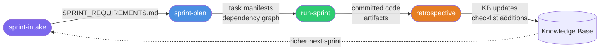
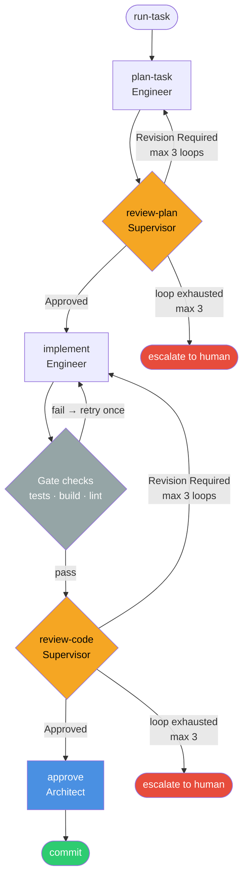

# Command Reference

Forge commands fall into three categories. Choose the section that matches what you need.

---

## Forge plugin commands

Manage the Forge installation and project-level generated artifacts. Run from any project directory.

| Command | Purpose |
|---|---|
| [`/forge:init`](forge/init.md) | Bootstrap a complete SDLC instance from a codebase |
| [`/forge:health`](forge/health.md) | Detect stale docs, orphaned entities, skill gaps |
| [`/forge:regenerate`](forge/regenerate.md) | Refresh generated workflows, templates, tools, or KB docs |
| [`/forge:update`](forge/update.md) | Propagate a plugin version upgrade into project artifacts |
| [`/forge:add-pipeline`](forge/add-pipeline.md) | Add or manage custom task pipelines |
| [`/forge:report-bug`](forge/report-bug.md) | File a bug against Forge itself |

---

## Sprint commands

Drive the sprint lifecycle — from requirements capture through retrospective.

| Command | Purpose |
|---|---|
| [`/sprint-intake`](sprint/intake.md) | Interview the user and produce structured sprint requirements |
| [`/sprint-plan`](sprint/plan.md) | Break requirements into tasks with estimates and a dependency graph |
| [`/run-sprint`](sprint/run.md) | Execute all sprint tasks through the pipeline in dependency waves |
| [`/retrospective`](sprint/retrospective.md) | Close a sprint and feed learnings back into the knowledge base |

---

## Task pipeline commands

Each command handles one phase of the task lifecycle. The orchestrator calls these in sequence; you can also invoke them directly to drive individual phases.

| Command | Role | Purpose |
|---|---|---|
| [`/run-task`](task-pipeline/run-task.md) | Orchestrator | Drive a single task through the complete pipeline end-to-end |
| [`/plan-task`](task-pipeline/plan.md) | Engineer | Research the codebase and write an implementation plan |
| [`/review-plan`](task-pipeline/review-plan.md) | Supervisor | Adversarially review the plan for feasibility and completeness |
| [`/implement`](task-pipeline/implement.md) | Engineer | Implement the approved plan; run tests; document |
| [`/review-code`](task-pipeline/review-code.md) | Supervisor | Review the implementation against plan, checklist, and security criteria |
| [`/approve`](task-pipeline/approve.md) | Architect | Final architectural sign-off before commit |
| [`/commit`](task-pipeline/commit.md) | Engineer | Stage artifacts and code; create a formatted commit |
| [`/fix-bug`](task-pipeline/fix-bug.md) | Engineer | Triage, root-cause, fix, and classify a bug |

---

## Lifecycle overview

### Sprint lifecycle

### Task pipeline

