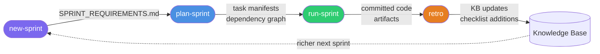
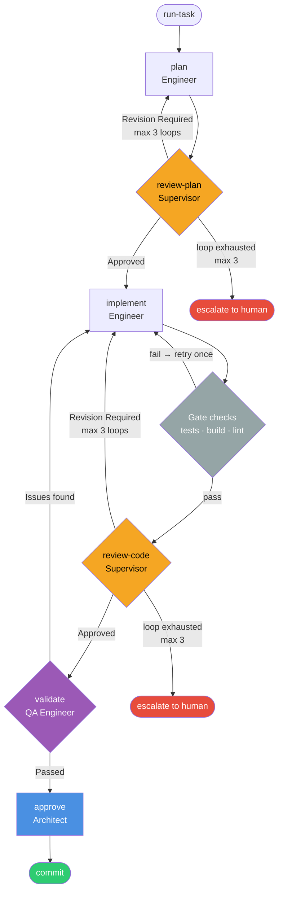

# Command Reference

Forge commands fall into three tiers. Tier 1 covers daily use; Tier 2 covers sprint operations; Tier 3 covers advanced maintenance and customization. Task pipeline commands are a separate group used by the orchestrator and for manual phase invocation.

---

## Tier 1 — Daily use

Run from any Forge-initialized project directory.

| Command | Purpose |
|---|---|
| [`/forge:init`](forge/init.md) | Bootstrap a complete SDLC instance from a codebase |
| [`/forge:new-sprint`](sprint/new-sprint.md) | Interview you and produce structured sprint requirements |
| [`/forge:status`](forge/status.md) | Show current sprint, task statuses, and recent activity |
| [`/forge:health`](forge/health.md) | Detect stale docs, orphaned entities, missing skills; `--fix` for maintenance |
| [`/forge:ask`](forge/ask.md) | Ask Tomoshibi about project status, config, workflows, or what to do next |

---

## Tier 2 — Sprint operations

| Command | Purpose |
|---|---|
| [`/forge:plan-sprint`](sprint/plan-sprint.md) | Break requirements into tasks with estimates and a dependency graph |
| [`/forge:run-sprint SPRINT-ID`](sprint/run.md) | Execute all sprint tasks through the pipeline in dependency waves |
| [`/forge:run-task TASK-ID`](task-pipeline/run-task.md) | Drive a single task through the complete pipeline end-to-end |
| [`/forge:retro SPRINT-ID`](sprint/retro.md) | Close a sprint and feed learnings back into the knowledge base |
| [`/forge:rebuild [target]`](forge/rebuild.md) | Refresh generated workflows, templates, tools, or knowledge-base docs |

---

## Tier 3 — Maintenance and customization

| Command | Purpose |
|---|---|
| [`/forge:search`](forge/search.md) | Query the Forge store by natural language or exact flags |
| [`/forge:repair`](forge/repair.md) | Diagnose and repair corrupted store records |
| [`/forge:check-agent`](forge/check-agent.md) | Verify an agent has loaded and understood the project KB |
| [`/forge:config`](forge/config.md) | Inspect project config |
| [`/forge:update`](forge/update.md) | Propagate a plugin version upgrade into project artifacts |
| [`/forge:add-pipeline [name]`](forge/add-pipeline.md) | Add, customize, view, or remove custom task pipelines |
| [`/forge:add-task`](forge/add-task.md) | Add a task to an existing sprint mid-flight |
| [`/forge:remove`](forge/remove.md) | Remove Forge artifacts from the current project (3 levels) |
| [`/forge:report-bug`](forge/report-bug.md) | File a bug against Forge — gathers context and opens a GitHub issue |

---

## Task pipeline commands

Each command handles one phase of the task lifecycle. The orchestrator calls these in sequence; you can also invoke them directly to drive individual phases.

| Command | Role | Purpose |
|---|---|---|
| [`/forge:plan`](task-pipeline/plan.md) | Engineer | Research the codebase and write an implementation plan |
| [`/forge:review-plan`](task-pipeline/review-plan.md) | Supervisor | Adversarially review the plan for feasibility and completeness |
| [`/forge:implement`](task-pipeline/implement.md) | Engineer | Implement the approved plan; run tests; document |
| [`/forge:review-code`](task-pipeline/review-code.md) | Supervisor | Review the implementation against plan, checklist, and security criteria |
| [`/forge:approve`](task-pipeline/approve.md) | Architect | Final architectural sign-off before commit |
| [`/forge:commit`](task-pipeline/commit.md) | Engineer | Stage artifacts and code; create a formatted commit |
| [`/forge:fix-bug BUG-ID`](task-pipeline/fix-bug.md) | Engineer | Triage, root-cause, fix, and classify a bug |

---

## Lifecycle overview

### Sprint lifecycle

### Task pipeline

