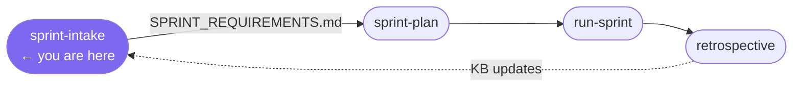

# /sprint-intake

**Role:** Architect  
**Lifecycle position:** First step of every sprint — nothing is planned without a completed requirements document.

---

## Purpose

Interviews the user to capture structured sprint requirements. Produces `SPRINT_REQUIREMENTS.md` — the document that `/sprint-plan` reads as its primary input.

The Architect does not accept vague answers. "TBD" and "to be decided" are not acceptable in a completed requirements document. It will probe until every required section has a specific, actionable answer.

---

## Invocation

```bash
/sprint-intake
```

No arguments. The sprint ID is assigned automatically from the store (next sequential ID).

---

## Reads

| Source | Purpose |
|---|---|
| `.forge/store/sprints/` | Determine next sprint ID |
| Previous sprint's retrospective | Surface carry-over items and recurring themes to probe |
| `engineering/MASTER_INDEX.md` | Project state context |

---

## Interview structure

The Architect works through six topic areas, probing until each has a specific answer:

| Step | Question asked | What it's looking for |
|---|---|---|
| Goals | What does a successful sprint look like? | 1–3 concrete, observable outcomes |
| Scope | What features/fixes are in this sprint? | Must-haves vs nice-to-haves; dependency order |
| Out of scope | What are we explicitly NOT doing? | Prevents scope creep during planning |
| Acceptance criteria | How will the Supervisor know each item is correctly implemented? | Testable, specific conditions |
| Constraints | Technical, data, dependency, or timeline constraints? | Inputs to task estimation |
| Risks | What could go wrong or block progress? | Inputs to task ordering and estimates |

Before writing, the Architect summarises in plain language and asks for corrections.

---

## Produces

```
engineering/sprints/{SPRINT_ID}/
  SPRINT_REQUIREMENTS.md    ← primary output
```

The sprint directory is created if it does not exist.

---

## Gate checks

- Every Required section of `SPRINT_REQUIREMENTS.md` must have a non-vague answer before the document is written.
- If the user signals they want to move on without completing a required section, the Architect asks again — it does not write a partial document.

---

## On failure / blockers

| Situation | Behaviour |
|---|---|
| User gives vague answers | Probe with follow-up questions until specific |
| User cannot answer a required section | Note it explicitly as a risk and mark it `[OPEN]` in the document — do not skip it silently |
| Previous retrospective shows carry-over items | Surface them during Goals step; ask whether they're in scope |

---

## Hands off to

```
/sprint-plan
```

The Architect tells the user explicitly: *"Run `/sprint-plan` when you're ready to break these into tasks."*

---

## In the sprint lifecycle


