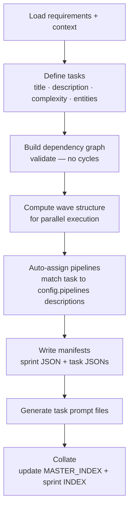
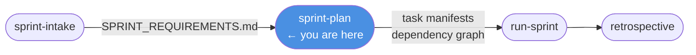

# /sprint-plan

**Role:** Architect  
**Lifecycle position:** After `/sprint-intake`; before `/run-sprint`.

---

## Purpose

Breaks the sprint requirements document into a concrete task set — with estimates, dependencies, and a wave structure for parallel execution. Writes task and sprint manifests to the store. Assigns custom pipelines to tasks where applicable.

---

## Invocation

```bash
/sprint-plan
```

No arguments. Reads the requirements document for the current sprint automatically.

---

## Reads

| Source | Purpose |
|---|---|
| `engineering/sprints/{SPRINT_ID}/SPRINT_REQUIREMENTS.md` | Primary input — **must exist**. Stops and directs to `/sprint-intake` if absent. |
| `engineering/MASTER_INDEX.md` | Current project state, completed work |
| Previous sprint retrospective | Carry-over items, recurring patterns |
| `.forge/config.json` → `pipelines` | Pipeline definitions for auto-assignment |

---

## Algorithm



### Task definition

For each task the Architect produces:
- Title and description
- Complexity estimate: `S` / `M` / `L` / `XL`
- Dependencies on other tasks in the sprint
- Relevant entities and architecture areas
- `pipeline` field — set if the task description matches a named pipeline's `description` in `config.pipelines`; omitted otherwise (orchestrator uses default)

### Dependency graph and waves

Dependencies form a directed acyclic graph. The Architect validates there are no cycles, then computes waves — groups of tasks with no unresolved dependencies that can run in parallel:

```
Wave 1: T01 (no deps), T02 (no deps)
Wave 2: T03 (needs T02), T04 (needs T02)
Wave 3: T05 (needs T03 + T04)
```

### Pipeline auto-assignment

If `config.pipelines` contains non-default pipelines, each task's description is matched against those pipelines' `description` fields. A pipeline is assigned only when the match is unambiguous — when uncertain, the field is omitted.

---

## Produces

```
.forge/store/sprints/{SPRINT_ID}.json      ← sprint manifest
.forge/store/tasks/{TASK_ID}.json          ← one per task (includes pipeline field if assigned)
engineering/sprints/{SPRINT_ID}/
  {TASK_ID}/
    TASK_PROMPT.md                         ← one per task
engineering/MASTER_INDEX.md               ← updated
engineering/sprints/{SPRINT_ID}/INDEX.md  ← new
```

---

## Gate checks

- `SPRINT_REQUIREMENTS.md` must exist and be complete — hard stop if absent.
- Dependency graph must be acyclic — will not write manifests if a cycle is detected.

---

## On failure / blockers

| Situation | Behaviour |
|---|---|
| Requirements document missing | Stop; instruct user to run `/sprint-intake` |
| Circular dependency detected | Report the cycle; ask user to clarify dependencies before proceeding |
| Pipeline key referenced but not in config | Omit the `pipeline` field — do not guess |

---

## Hands off to

```
/run-sprint {SPRINT_ID}
```

The user reviews the generated task list (JSON in `.forge/store/tasks/` or the generated prompt files) before running.

---

## In the sprint lifecycle


