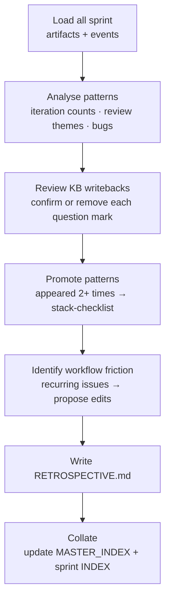
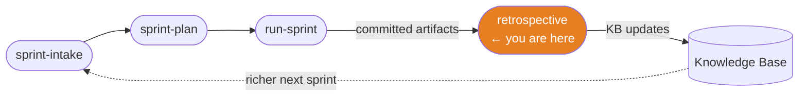

# /retrospective

**Role:** Architect + Collator  
**Lifecycle position:** After all sprint tasks are committed. Closes the sprint.

---

## Purpose

Reviews what happened during the sprint, extracts learnings, updates the knowledge base, and proposes workflow improvements. The retrospective is the primary mechanism by which Forge gets smarter over time — skipping it leaves the knowledge base stale.

---

## Invocation

```bash
/retrospective S01
```

The sprint ID must match a completed sprint in `.forge/store/sprints/`.

---

## Reads

| Source | Purpose |
|---|---|
| `engineering/sprints/{SPRINT_ID}/{TASK_ID}/` | PLAN.md, PROGRESS.md, CODE_REVIEW.md for all tasks |
| `.forge/store/events/{SPRINT_ID}/` | All phase events — timing, iteration counts, escalations |
| `.forge/store/bugs/` | Bugs filed and fixed during the sprint |
| `engineering/stack-checklist.md` | Current checklist — basis for proposed additions |
| Previous retrospective | Trend comparison |

---

## Algorithm



### Pattern analysis

The retrospective reads iteration counts from event records to identify where the pipeline struggled:

| Signal | What it means |
|---|---|
| Many plan revision loops | Acceptance criteria were underspecified at planning time |
| Many code review loops | Engineer deviated from plan, or plan had gaps |
| Recurring review feedback themes | Should become stack-checklist items |
| Recurring bug root cause categories | Should become preventive checks |

### Knowledge base updates

All `[?]` markers written during the sprint (by Engineers and Supervisors discovering uncertain project knowledge) are reviewed:
- Confirmed entries are cleaned up
- Patterns appearing 2+ times are promoted to `stack-checklist.md` as permanent items
- Domain doc errors are corrected

### Workflow improvement proposals

If a workflow step consistently caused friction or a template section was consistently skipped, the retrospective proposes a specific edit. These are proposals — the user decides whether to apply them via `/forge:regenerate workflows`.

---

## Produces

```
engineering/sprints/{SPRINT_ID}/
  RETROSPECTIVE.md          ← sprint summary, metrics, KB updates, workflow proposals
engineering/stack-checklist.md    ← updated with promoted patterns
engineering/business-domain/
  entity-model.md           ← corrected [?] items
engineering/MASTER_INDEX.md       ← updated via collation
engineering/sprints/{SPRINT_ID}/INDEX.md  ← updated via collation
.forge/store/sprints/{SPRINT_ID}.json     ← status set to `completed`
```

---

## Gate checks

None that block execution. The retrospective runs over whatever is committed — partial sprints produce partial retrospectives.

---

## On failure / blockers

| Situation | Behaviour |
|---|---|
| Sprint has uncommitted tasks | Note them in the retrospective as carry-over; do not block |
| No events in store | Proceed with artifact-only analysis; note the gap |

---

## After the retrospective

The knowledge base has been updated. Consider whether the changes are substantial enough to warrant regenerating the workflows:

```bash
/forge:regenerate workflows   # if retrospective revealed significant new patterns
```

Then begin the next sprint:

```bash
/sprint-intake
```

---

## In the sprint lifecycle


