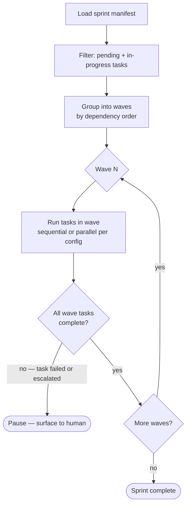
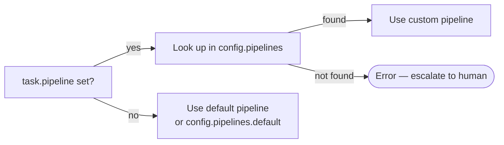
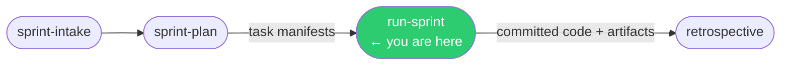

# /run-sprint

**Role:** Orchestrator  
**Lifecycle position:** After `/sprint-plan`; tasks must have manifests in the store.

---

## Purpose

Executes all tasks in a sprint, respecting the dependency graph computed during planning. Tasks in the same dependency wave can run in parallel. Each task is driven through its full pipeline (or custom pipeline) end-to-end before the wave closes.

---

## Invocation

```bash
/run-sprint S01           # execute sprint S01
/run-sprint S01 --resume  # resume from the last incomplete task
```

The sprint ID matches the directory under `engineering/sprints/` and the manifest in `.forge/store/sprints/`.

---

## Reads

| Source | Purpose |
|---|---|
| `.forge/store/sprints/{SPRINT_ID}.json` | Sprint manifest — wave structure, task list |
| `.forge/store/tasks/{TASK_ID}.json` | Task manifests — status, pipeline assignment |
| `.forge/config.json` → `pipelines` | Pipeline definitions for task routing |

---

## Execution model



### Wave execution

Each wave contains all tasks whose dependencies are satisfied by committed work in prior waves. Within a wave, execution mode is controlled by `config.sprint.execution.mode`:

| Mode | Behaviour |
|---|---|
| `sequential` (default) | One task at a time within a wave |
| `wave-parallel` | All tasks in a wave run concurrently (separate worktrees) |
| `full-parallel` | All tasks across all waves run concurrently — no dependency enforcement |

### Per-task pipeline

For each task, the orchestrator resolves the pipeline:



Each resolved pipeline runs through its phases in order. Review phases loop on "Revision Required" up to `maxIterations` (default 3). See [`/run-task`](../task-pipeline/run-task.md) for the per-task detail.

---

## Produces

Per task (see [`/run-task`](../task-pipeline/run-task.md)):
```
engineering/sprints/{SPRINT_ID}/{TASK_ID}/
  PLAN.md
  PLAN_REVIEW.md
  PROGRESS.md
  CODE_REVIEW.md
  ARCHITECT_APPROVAL.md
.forge/store/tasks/{TASK_ID}.json   ← status updated to `committed`
.forge/store/events/{SPRINT_ID}/    ← one event JSON per phase
```

---

## Gate checks

- Sprint manifest must exist in the store — stops if absent.
- Each task must be in `pending` or `in-progress` status to be executed.
- A task is not started until all its dependencies have status `committed`.

---

## On failure / blockers

| Situation | Behaviour |
|---|---|
| Task pipeline escalates | Pause the sprint at that task; surface to human; resume with `--resume` after resolution |
| Git merge conflict | Escalate to human — never auto-resolve |
| Test / build failure after max retries | Escalate to human |
| `task.pipeline` key not found in config | Escalate immediately — do not fall back silently |
| `--resume` flag | Skip tasks with status `committed`; continue from first `pending` or `in-progress` task |

---

## Hands off to

```
/retrospective {SPRINT_ID}
```

All tasks committed. The Orchestrator reports the sprint summary and directs the user to run the retrospective.

---

## In the sprint lifecycle


