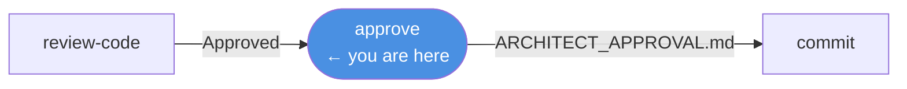

# /approve

**Role:** Architect  
**Pipeline position:** Phase 5 of the default task pipeline. Final gate before commit.

---

## Purpose

The Architect gives architectural sign-off on a completed, Supervisor-approved task. This is the last human-equivalent gate in the pipeline. The Architect looks beyond correctness — at cross-cutting concerns, operational impact, and whether the implementation fits the project's long-term architecture.

---

## Invocation

```bash
/approve PROJ-S01-T03    # usually called by /run-task; can be invoked directly
```

---

## Reads

| Source | Purpose |
|---|---|
| `engineering/sprints/{SPRINT_ID}/{TASK_ID}/TASK_PROMPT.md` | Original intent |
| `engineering/sprints/{SPRINT_ID}/{TASK_ID}/PLAN.md` | Final approved plan |
| `engineering/sprints/{SPRINT_ID}/{TASK_ID}/CODE_REVIEW.md` | Supervisor verdict (must be Approved) |
| `engineering/sprints/{SPRINT_ID}/{TASK_ID}/PROGRESS.md` | What was done |
| `engineering/architecture/*.md` | Architecture to verify alignment against |

---

## Review focus

The Architect is not re-doing the Supervisor's review. It looks specifically at:

| Area | What is checked |
|---|---|
| Architecture alignment | Does this fit the project's established patterns and boundaries? |
| Cross-cutting concerns | Does this change affect other modules, services, or consumers? |
| Operational impact | Are there deployment steps, migrations, or config changes needed? |
| Follow-up items | Are there related changes that should be scheduled in a future sprint? |

---

## Produces

```
engineering/sprints/{SPRINT_ID}/{TASK_ID}/
  ARCHITECT_APPROVAL.md
.forge/store/tasks/{TASK_ID}.json    ← status: approved
.forge/store/events/{SPRINT_ID}/     ← approve event
```

### ARCHITECT_APPROVAL.md structure

| Section | Content |
|---|---|
| Approval status | `Approved` |
| Deployment notes | Any steps required outside the commit |
| Follow-up items | Issues to address in a future sprint |

---

## Gate checks

- `CODE_REVIEW.md` must exist with a non-"Revision Required" verdict.
- If the Supervisor's verdict was "Revision Required", the orchestrator will not reach this phase.

---

## On failure / blockers

| Situation | Behaviour |
|---|---|
| Architectural concern discovered | Write it as a follow-up item — do not re-open the implementation loop unless the concern is blocking |
| Deployment steps required | Document them in ARCHITECT_APPROVAL.md; the commit phase will include them |

---

## Hands off to

```
/commit PROJ-S01-T03
```

---

## In the task pipeline


