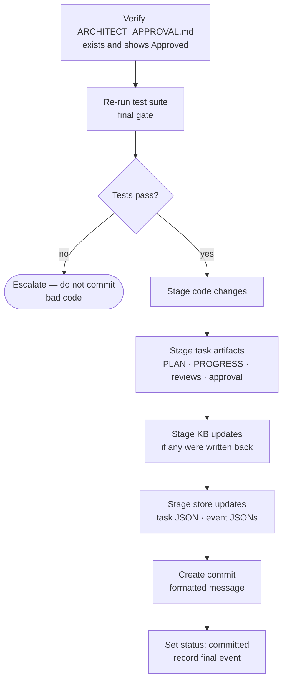
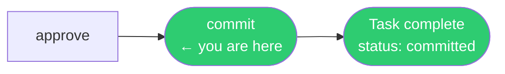

# /commit

**Role:** Engineer  
**Pipeline position:** Phase 6 (final) of the default task pipeline.

---

## Purpose

Stages all task artifacts and code changes, re-runs the test suite as a final gate, and creates a well-formatted commit. The commit closes the task in the store.

---

## Invocation

```bash
/commit PROJ-S01-T03    # usually called by /run-task; can be invoked directly
```

---

## Reads

| Source | Purpose |
|---|---|
| `engineering/sprints/{SPRINT_ID}/{TASK_ID}/ARCHITECT_APPROVAL.md` | Must exist with approval status — hard prerequisite |
| `.forge/store/tasks/{TASK_ID}.json` | Task metadata for commit message formatting |

---

## Algorithm



### Commit message format

```
{type}: {summary} [{TASK_ID}]

Co-Authored-By: {agent-name} <noreply@anthropic.com>
```

Types follow conventional commits: `feat`, `fix`, `refactor`, `test`, `docs`, `chore`.

The `--no-verify` flag is **never used**. If a pre-commit hook fails, the Engineer diagnoses and fixes the issue, then creates a new commit.

---

## What gets staged

| Category | What |
|---|---|
| Code changes | All modified source files |
| Task artifacts | PLAN.md, PLAN_REVIEW.md, PROGRESS.md, CODE_REVIEW.md, ARCHITECT_APPROVAL.md |
| Knowledge base updates | Any architecture / entity-model / stack-checklist changes tagged with this task ID |
| Store updates | `.forge/store/tasks/{TASK_ID}.json`, `.forge/store/events/{SPRINT_ID}/*.json` |

---

## Gate checks

| Check | Behaviour on failure |
|---|---|
| `ARCHITECT_APPROVAL.md` exists | Hard stop — do not stage anything |
| Test suite passes | Hard stop — escalate; do not commit failing code |
| Pre-commit hook passes | Diagnose and fix; never bypass with `--no-verify` |

---

## Produces

```
Git commit containing all of the above
.forge/store/tasks/{TASK_ID}.json    ← status: committed
.forge/store/events/{SPRINT_ID}/     ← commit event (final)
```

---

## On failure / blockers

| Situation | Behaviour |
|---|---|
| Tests fail at final re-run | Escalate to human — do not commit |
| Pre-commit hook fails | Diagnose root cause; fix; create new commit |
| ARCHITECT_APPROVAL.md missing | Hard stop; do not proceed |

---

## In the task pipeline


