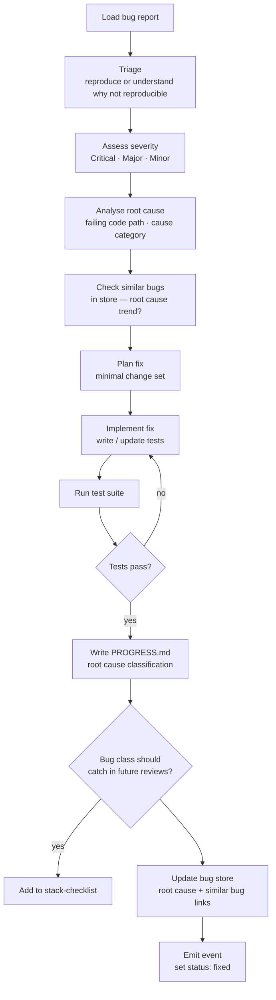
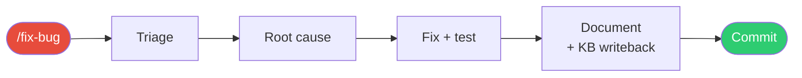

# /fix-bug

**Role:** Engineer  
**Lifecycle position:** Standalone — not part of the default task pipeline. Invoked directly for filed bugs.

---

## Purpose

Triages a reported bug, analyses the root cause, plans and implements a focused fix, and classifies the root cause for trend analysis. Unlike the task pipeline, fix-bug does not go through plan review — the triage itself is the plan.

---

## Invocation

```bash
/fix-bug PROJ-BUG-042
```

The bug ID must match a record in `.forge/store/bugs/`.

---

## Reads

| Source | Purpose |
|---|---|
| `.forge/store/bugs/{BUG_ID}.json` | Bug report — severity, description, reproduction steps |
| `.forge/store/bugs/` | Similar bugs — root cause trend analysis |
| `engineering/business-domain/entity-model.md` | Domain rules to verify during root cause analysis |
| `engineering/architecture/*.md` | Relevant architecture for understanding the failing code path |
| Codebase (Grep, Read) | Locate and understand the failing code path |

---

## Algorithm



### Root cause categories

| Category | Description |
|---|---|
| `validation` | Input not validated at the boundary |
| `auth` | Missing or incorrect auth check |
| `business-rule` | Domain rule not correctly implemented |
| `concurrency` | Race condition or missing lock |
| `data-integrity` | Missing constraint or incorrect migration |
| `integration` | External API or service contract mismatch |
| `performance` | N+1 query, missing index, unbounded operation |
| `infrastructure` | Config, environment, or deployment issue |

### Fix scope

The fix is intentionally minimal — the failing behaviour, nothing else. Opportunistic refactoring during a bug fix introduces risk and obscures the change. If broader work is needed, it is noted as a follow-up task.

---

## Produces

```
engineering/bugs/{BUG_ID}/
  PROGRESS.md                          ← what was done + test evidence
.forge/store/bugs/{BUG_ID}.json        ← root cause classification + similar bug links; status: fixed
engineering/stack-checklist.md         ← new item if bug class should be caught in future reviews
engineering/business-domain/
  entity-model.md                      ← corrected if a domain rule was wrong
.forge/store/events/                   ← fix events
```

---

## Gate checks

| Check | Behaviour on failure |
|---|---|
| Test suite must pass | Fix and retry — do not close bug without passing tests |
| Bug must be reproducible (or clearly unreproducible) | If not reproducible, document the investigation and mark `cannot-reproduce` |

---

## On failure / blockers

| Situation | Behaviour |
|---|---|
| Bug is not reproducible | Document investigation; set status to `cannot-reproduce`; escalate to human |
| Root cause is in an external dependency | Document the finding; create a follow-up task for the workaround or upgrade |
| Fix requires architecture-level changes | Note in PROGRESS.md; create a follow-up task; apply a minimal patch for now |

---

## Knowledge writeback

If the root cause reveals a pattern that should prevent future bugs of the same class, the Engineer adds a stack-checklist item:

```markdown
- [ ] Validate {input type} at {boundary} — see BUG-042 for failure mode
```

If the bug revealed that a domain rule was incorrectly documented, the entity model is corrected inline.

---

## Relationship to the task pipeline

Fix-bug does not go through plan review or the full review-code cycle. It is a self-contained workflow optimised for speed. For bugs that require significant architectural changes, file a standard task instead and route it through the normal pipeline.


