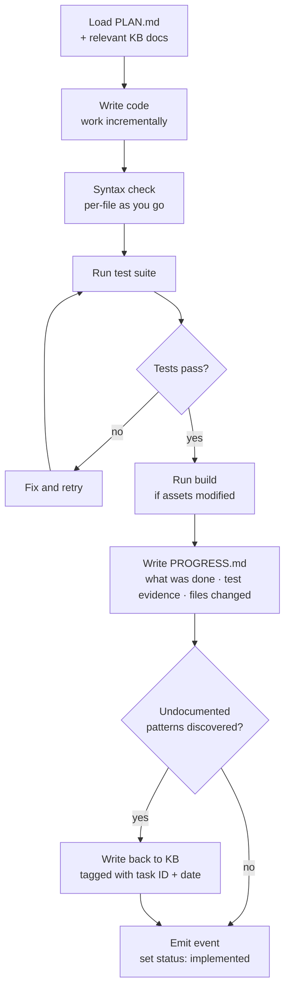
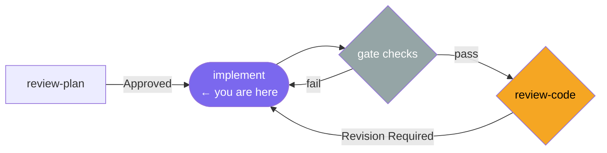

# /implement

**Role:** Engineer  
**Pipeline position:** Phase 3 of the default task pipeline. Runs after plan approval.

---

## Purpose

The Engineer implements the approved plan: writes code, runs verification gate checks, and documents what was done. The plan is the contract — implementation follows it. Deviations from the plan must be noted in PROGRESS.md, because the Supervisor reads both.

---

## Invocation

```bash
/implement PROJ-S01-T03    # usually called by /run-task; can be invoked directly
```

---

## Reads

| Source | Purpose |
|---|---|
| `engineering/sprints/{SPRINT_ID}/{TASK_ID}/PLAN.md` | The approved plan — primary guide |
| `engineering/architecture/*.md` | Relevant architecture docs |
| `engineering/business-domain/entity-model.md` | Entity model for domain rule accuracy |
| `engineering/sprints/{SPRINT_ID}/{TASK_ID}/PLAN_REVIEW.md` | Advisory notes from the Supervisor |

---

## Algorithm



### PROGRESS.md structure

| Section | Content |
|---|---|
| What was done | Narrative summary of the implementation |
| Deviations from plan | Anything that diverged and why — the Supervisor will look for this |
| Test evidence | Copied test output proving the suite passes |
| Files changed | Explicit list of every file modified |

The Supervisor treats PROGRESS.md as a *checklist hint*, not ground truth. Every file in the list will be read directly.

### Knowledge writeback

Patterns discovered during implementation that are not in the knowledge base are written back inline and tagged:

```markdown
<!-- Discovered during PROJ-S01-T03 — 2026-04-02 -->
```

---

## Gate checks (run before handing off to review)

| Check | Command |
|---|---|
| Syntax verification | Per-file syntax checker (language-specific) |
| Test suite | Project test command from config |
| Build | Project build command (if frontend assets changed) |

All three must pass before the orchestrator calls `/review-code`. If a gate fails, the error is passed back to the Engineer for a retry. After one retry, the orchestrator escalates.

---

## Produces

```
engineering/sprints/{SPRINT_ID}/{TASK_ID}/
  PROGRESS.md
Code changes (not yet committed)
.forge/store/tasks/{TASK_ID}.json    ← status: implemented
.forge/store/events/{SPRINT_ID}/     ← implement_complete event
```

---

## On failure / blockers

| Situation | Behaviour |
|---|---|
| Test failure | Fix and re-run; note the failure in PROGRESS.md deviations |
| Plan is infeasible as written | Note the blocker in PROGRESS.md; the Supervisor's review will catch the deviation and route back for plan revision |
| Build tooling unavailable | Note in PROGRESS.md; proceed without the build gate check if genuinely unavailable |

---

## Hands off to

```
/review-code PROJ-S01-T03
```

Only after all gate checks pass.

---

## In the task pipeline


