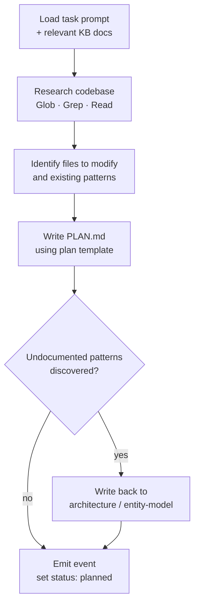
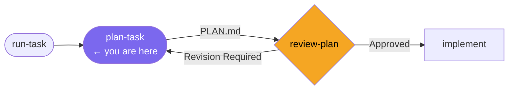

# /plan-task

**Role:** Engineer  
**Pipeline position:** Phase 1 of the default task pipeline.

---

## Purpose

The Engineer reads the task prompt, researches the codebase, and produces a structured implementation plan. The plan is the contract between the Engineer and the Supervisor — it states the approach, the files to change, and the acceptance criteria evidence that will be provided.

---

## Invocation

```bash
/plan-task PROJ-S01-T03    # usually called by /run-task; can be invoked directly
```

---

## Reads

| Source | Purpose |
|---|---|
| `engineering/sprints/{SPRINT_ID}/{TASK_ID}/TASK_PROMPT.md` | Task intent and acceptance criteria |
| `engineering/architecture/*.md` | Relevant sub-docs only — not the full set |
| `engineering/business-domain/entity-model.md` | Entity relationships relevant to the task |
| `engineering/stack-checklist.md` | Review criteria to anticipate during planning |
| Codebase (Glob, Grep, Read) | Files that will need modification; existing patterns |

---

## Algorithm



### PLAN.md structure

| Section | Content |
|---|---|
| Objective | What this task achieves, in one sentence |
| Approach | How it will be implemented — not what, but why this approach |
| Files to modify | Exact paths and what changes in each |
| Data model changes | Schema changes, migrations required |
| Testing strategy | Which tests are added or modified; acceptance criteria evidence |
| Operational impact | Migrations, config changes, deployment steps |

### Knowledge writeback

If the Engineer discovers patterns during research that are not documented in the knowledge base, they update the relevant architecture or entity-model doc inline, tagged with:

```markdown
<!-- Discovered during {TASK_ID} — {date} -->
```

These are reviewed and confirmed (or removed) during the sprint retrospective.

---

## Produces

```
engineering/sprints/{SPRINT_ID}/{TASK_ID}/
  PLAN.md
.forge/store/tasks/{TASK_ID}.json    ← status: planned
.forge/store/events/{SPRINT_ID}/     ← plan_complete event
```

---

## Gate checks

None on output — the Supervisor's review is the gate. The Engineer is not the reviewer of their own plan.

---

## On failure / blockers

| Situation | Behaviour |
|---|---|
| Task prompt is ambiguous | Note the ambiguity in PLAN.md under Risks; the Supervisor will surface it during review |
| Required architecture doc does not exist | Note the gap; update the entity model if possible; flag for the Supervisor |

---

## Hands off to

```
/review-plan PROJ-S01-T03
```

---

## In the task pipeline


