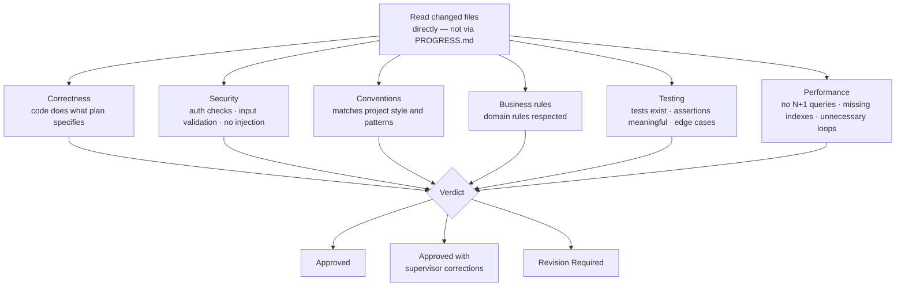
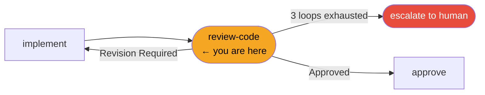
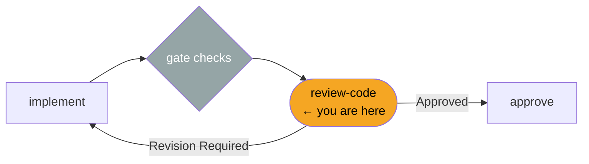

# /review-code

**Role:** Supervisor  
**Pipeline position:** Phase 4 of the default task pipeline. Review gate between implementation and approval.

---

## Purpose

The Supervisor reviews the completed implementation for correctness, security, conventions, and business rule compliance. This review is independent — the Supervisor reads the actual changed files, not just the Engineer's account of them.

PROGRESS.md is a *checklist hint*, not a source of truth. Plans evolve during implementation. Tests can pass and still be inadequate. The Supervisor verifies what was actually built.

---

## Invocation

```bash
/review-code PROJ-S01-T03    # usually called by /run-task; can be invoked directly
```

---

## Reads

| Source | Purpose |
|---|---|
| `engineering/sprints/{SPRINT_ID}/{TASK_ID}/TASK_PROMPT.md` | Original intent — ground truth |
| `engineering/sprints/{SPRINT_ID}/{TASK_ID}/PLAN.md` | Approved approach — verify it was followed |
| `engineering/sprints/{SPRINT_ID}/{TASK_ID}/PROGRESS.md` | Checklist hint only — not trusted as complete |
| Every file listed in PROGRESS.md | Read directly — the Supervisor verifies each one |
| `engineering/stack-checklist.md` | Concrete review criteria |
| `engineering/architecture/*.md` | Architecture patterns to verify against |
| `engineering/business-domain/entity-model.md` | Domain rules to verify |

---

## Review categories



### Common rationalizations to reject

| Engineer says | Supervisor checks |
|---|---|
| "PROGRESS.md confirms all items done" | PROGRESS.md is self-reported — read the code |
| "Tests pass so it must be correct" | Tests can be inadequate — check coverage and assertions |
| "The plan was approved so the approach is fine" | Plans evolve during implementation — verify what was built |

---

## Produces

```
engineering/sprints/{SPRINT_ID}/{TASK_ID}/
  CODE_REVIEW.md
engineering/stack-checklist.md    ← updated if new patterns should be caught in future
.forge/store/tasks/{TASK_ID}.json    ← status: code_approved or code_revision_required
.forge/store/events/{SPRINT_ID}/     ← review_code event with verdict
```

### CODE_REVIEW.md verdicts

| Verdict | Meaning | Next step |
|---|---|---|
| `Approved` | Implementation meets all criteria | → `/approve` |
| `Approved with supervisor corrections` | Minor issues fixed inline by Supervisor | → `/approve` |
| `Revision Required` | Named issues must be addressed by Engineer | → loop back to `/implement` |

"Revision Required" items must be numbered and actionable, with `file:line` references where applicable. Vague feedback ("improve error handling") is not acceptable.

---

## Gate checks

- Verdict must be explicit — one of the three above. No implicit approvals.
- "Revision Required" items must reference specific files and lines.

---

## Revision loop



On "Revision Required", the orchestrator routes back to `/implement` with the review items as input. Maximum 3 loops. Loop exhaustion escalates to the human — the Supervisor never approves to unblock.

---

## Hands off to

On approval:
```
/approve PROJ-S01-T03
```

---

## In the task pipeline


