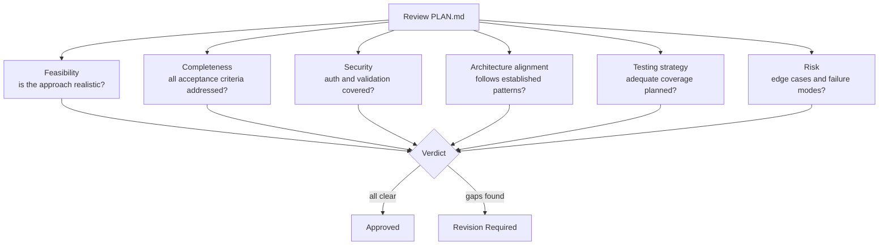
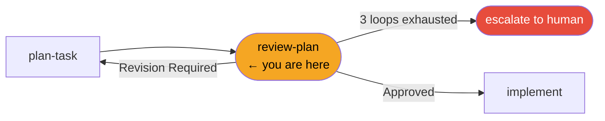
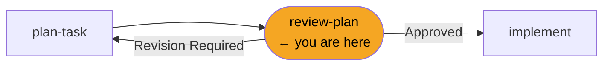

# /review-plan

**Role:** Supervisor  
**Pipeline position:** Phase 2 of the default task pipeline. Review gate between planning and implementation.

---

## Purpose

The Supervisor adversarially reviews the Engineer's implementation plan. This is not a rubber-stamp — the Supervisor evaluates the plan against what the task *actually requires*, not against what the plan *claims* to deliver.

Plans routinely understate complexity, omit edge cases, or skip security steps. The Supervisor's job is to catch these before implementation begins, when the cost of correction is lowest.

---

## Invocation

```bash
/review-plan PROJ-S01-T03    # usually called by /run-task; can be invoked directly
```

---

## Reads

| Source | Purpose |
|---|---|
| `engineering/sprints/{SPRINT_ID}/{TASK_ID}/TASK_PROMPT.md` | Source of truth for task intent — the plan is measured against this |
| `engineering/sprints/{SPRINT_ID}/{TASK_ID}/PLAN.md` | Subject of review — treated with healthy skepticism |
| `engineering/architecture/*.md` | Relevant sub-docs to cross-reference approach |
| `engineering/stack-checklist.md` | Concrete review criteria |

---

## Review categories



### Common rationalizations to reject

| Engineer says | Supervisor checks |
|---|---|
| "The plan covers all acceptance criteria" | Criteria can be met superficially — check depth and specificity |
| "Auth is handled" | Where exactly? Is it specified in the plan or assumed? |
| "Tests are mentioned" | Mentioned ≠ adequately planned — are the test cases specific? |

---

## Produces

```
engineering/sprints/{SPRINT_ID}/{TASK_ID}/
  PLAN_REVIEW.md
.forge/store/tasks/{TASK_ID}.json    ← status: plan_approved or plan_revision_required
.forge/store/events/{SPRINT_ID}/     ← review_plan event with verdict
```

### PLAN_REVIEW.md structure

| Verdict | Content |
|---|---|
| `Approved` | Confirmation + any advisory notes for implementation |
| `Revision Required` | Numbered, actionable items — specific gaps, not vague criticism |

If a check is identified that should be caught earlier in future sprints, the Supervisor adds it to `stack-checklist.md`.

---

## Gate checks

- Verdict must be explicit: `Approved` or `Revision Required`. No implicit approvals.

---

## Revision loop



On "Revision Required", the orchestrator routes back to `/plan-task` with the review items as input. Maximum 3 loops. If the plan is still not approved after 3 revisions, the orchestrator escalates to the human — it does not approve to unblock.

---

## Hands off to

On approval:
```
/implement PROJ-S01-T03
```

On escalation (loop exhaustion):
```
Human review required
```

---

## In the task pipeline


