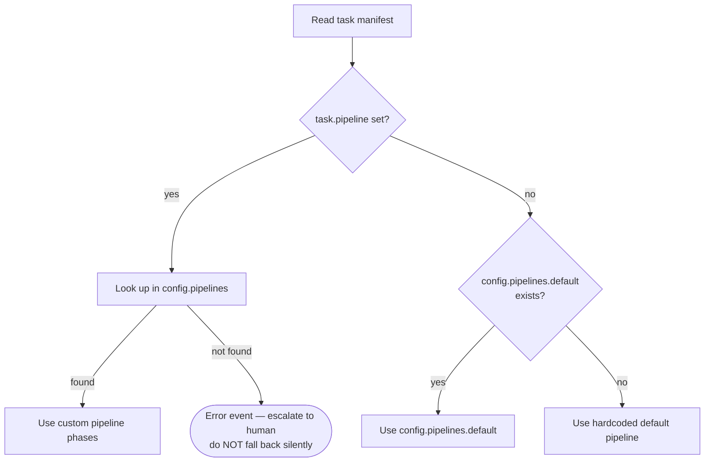
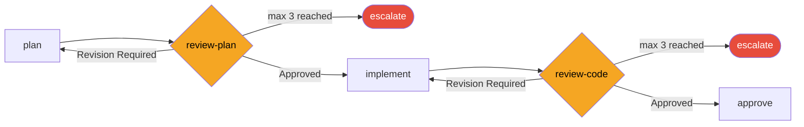
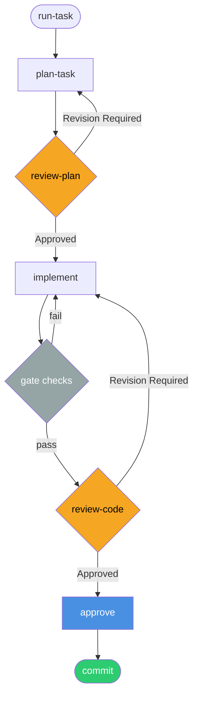

# /run-task

**Role:** Orchestrator  
**Lifecycle position:** Entry point for single-task execution. Calls all other task pipeline commands in sequence.

---

## Purpose

Drives a single task through its complete pipeline — plan, review, implement, review, approve, commit — handling gate checks, revision loops, escalation, and event emission at each phase. The orchestrator is the state machine; the atomic commands are its states.

Use `/run-task` when you want to execute one task in isolation rather than running the full sprint.

---

## Invocation

```bash
/run-task PROJ-S01-T03
```

The task ID must match a manifest in `.forge/store/tasks/`.

---

## Reads

| Source | Purpose |
|---|---|
| `.forge/store/tasks/{TASK_ID}.json` | Task manifest — status, pipeline assignment, dependencies |
| `.forge/config.json` → `pipelines` | Pipeline definitions for phase resolution |

---

## Pipeline resolution



### Default pipeline

```
plan → review-plan → implement → review-code → approve → commit
```

### Phase execution

For each phase in the resolved pipeline:

1. Emit a `phase_start` event to `.forge/store/events/`
2. Invoke the phase command with the task ID
3. Check gate conditions for the phase
4. On success: emit `phase_complete`, advance to next phase
5. On review verdict "Revision Required": loop back to preceding phase (up to `maxIterations`)
6. On gate failure: retry once, then escalate

---

## Gate checks (default pipeline)

| After phase | Gate checks |
|---|---|
| `implement` | Tests pass · build clean · lint clean |
| `review-code` | Verdict is Approved or Approved with corrections |
| `approve` | `ARCHITECT_APPROVAL.md` exists with approval status |

---

## Revision loops

Review phases loop back on "Revision Required":



Escalation means: emit an escalation event, surface the loop exhaustion to the human, and pause. The orchestrator never auto-approves to unblock the pipeline.

---

## Error recovery

| Error | Recovery |
|---|---|
| Test / build failure | Pass error output to Engineer; retry once |
| Verdict "Revision Required" | Enter revision loop (up to maxIterations) |
| Timeout / empty response | Retry subagent once with simplified prompt |
| Git hook failure | Diagnose and fix; create new commit — never `--no-verify` |
| Merge conflict | Escalate to human |
| `task.pipeline` key missing from config | Escalate immediately |

---

## Produces

```
engineering/sprints/{SPRINT_ID}/{TASK_ID}/
  PLAN.md
  PLAN_REVIEW.md
  PROGRESS.md
  CODE_REVIEW.md
  ARCHITECT_APPROVAL.md
.forge/store/tasks/{TASK_ID}.json        ← status: committed
.forge/store/events/{SPRINT_ID}/         ← one JSON per phase event
```

---

## Task pipeline


