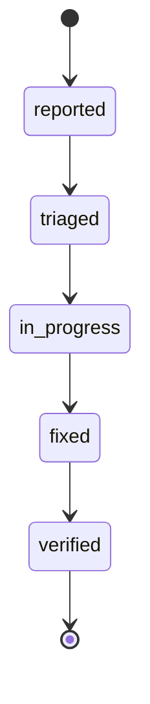

# Bug

A **Bug** is an independently tracked defect record. Bugs spawn from [Tasks](task.md) when an issue is discovered during development or feature testing. They operate similarly to tasks but focus on identifying and remediating root causes.

## Purpose

Separating Bugs from Tasks allows Forge to track the velocity of defect discovery, mandate root-cause categorization, and ensure structural regressions are fed back into the Knowledge Base via updated architectural rules or business constraints.

## Lifecycle

Bugs follow a streamlined path towards resolution:

*(Note: Internal JSON schema uses hyphens if applicable, though Bug's states are mostly single words except `in-progress`.)*

## Artifact locator

Like Tasks, a Bug carries an optional backend-agnostic `locator` (`{ backend, ref }`)
added in v1.0.7 (issue #111 Phase 3), with `path` as the required back-compat alias.
Bug artifacts (`TRIAGE.md`, `BUG_FIX_PLAN.md`, `*-SUMMARY.json`, …) are addressed by
`(entity, entityId, kind)` through the `ArtifactStore` provider, never by a
reconstructed path. See [Task § `locator` field](task.md#locator-field) for details.

For managing bugs, see the [Commands Reference](../commands/index.md).
