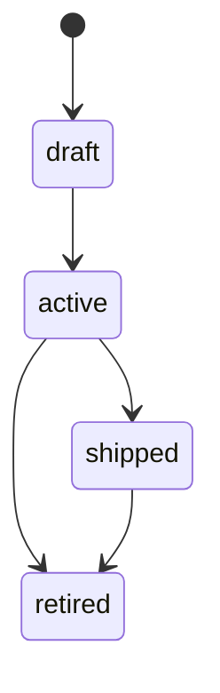

# Feature

A **Feature** is a vertical slice of product functionality. It is a persistent container that groups related development work and helps organize sprints into thematic boundaries.

## Purpose

Features allow product teams to reason about the system at a macro level, instead of dealing directly with transient task IDs. When defining a Sprint, you associate its tasks with specific Features, providing a traceable line from an individual code change back to a high-level product capability.

## Lifecycle

For commands related to managing features, see the [Commands Reference](../commands/index.md).
