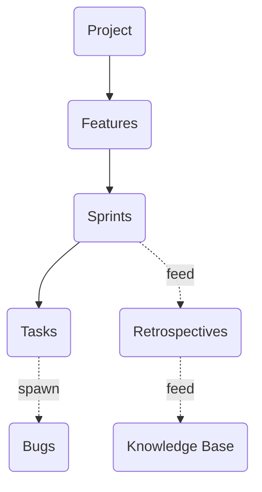

# Concepts Index

Forge is structured around a strict entity containment hierarchy designed to provide deterministic traceability from a high-level project down to individual bug fixes and the framework's knowledge base.

## Conceptual Containment Diagram

## Entities

- **[Project](project.md)**: The root organizational unit that represents the software being built.
- **[Features](feature.md)**: Vertical slices of the project, defining scope and acting as containers for related sprints.
- **[Sprints](sprint.md)**: Time-boxed execution cycles designed to deliver subsets of features.
- **[Tasks](task.md)**: Atomic work items executed within a sprint.
- **[Bugs](bug.md)**: Defect records spawned from tasks or testing, tracked independently.

## Associated Concepts

- **[Requirements](requirements.md)**: Where product intent and acceptance criteria live within the hierarchy.
- **[Feature Testing](feature-testing.md)**: The 3-layer test model and `FEAT-NNN` standard enforcing traceability.
- **[Extensibility](extensibility.md)**: The two-layer model separating the plugin's capabilities from project domain logic.

## Command Reference

To manage these entities via the command line, refer to the [Commands Reference](../commands/INDEX.md).
