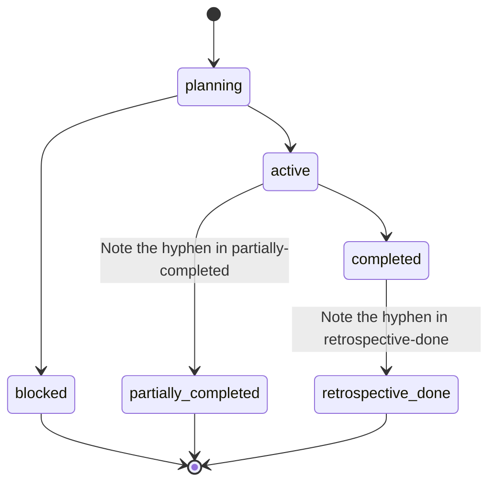
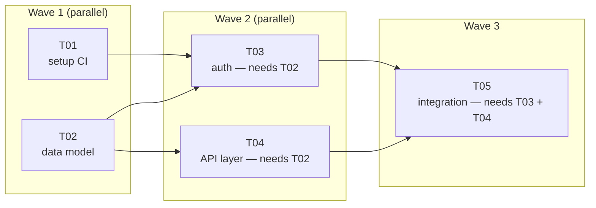
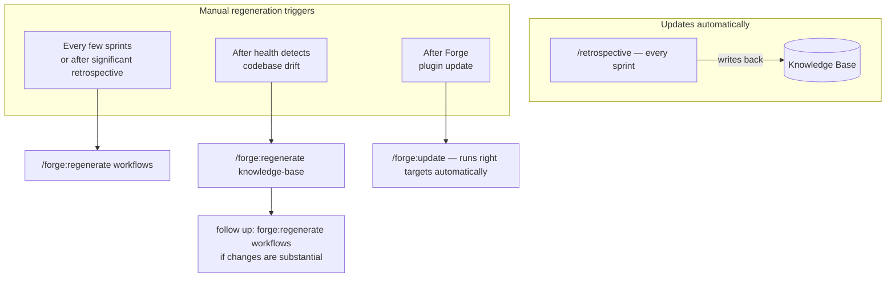

# Sprint

A **Sprint** is a bounded execution cycle that groups together multiple [Tasks](task.md) to be delivered as a coherent unit.

## Purpose

Sprints manage the cadence of delivery in Forge. They define what is being built *now*. Each Sprint maintains a localized artifact directory (`engineering/sprints/{SPRINT_ID}/`) containing the prompt documents for its tasks and a metadata file recording dependencies and state.

## Lifecycle

Sprints follow a strict workflow:

*(Note: Internal JSON schema uses hyphens in state names, e.g., `retrospective-done`, `partially-completed`.)*

For commands related to starting and managing sprints, see the [Commands Reference](../commands/index.md).

## Execution waves

When executing (`/run-sprint`), the orchestrator runs all tasks respecting the dependency graph. Independent tasks run in waves:

## Maintenance Cadence

A Sprint closes with a Retrospective (`/retrospective`). This phase is what makes Forge self-improving by updating the knowledge base directly.

Two things evolve over a project's lifetime: the **knowledge base** (KB) and the **generated workflows**. They update through different mechanisms:

