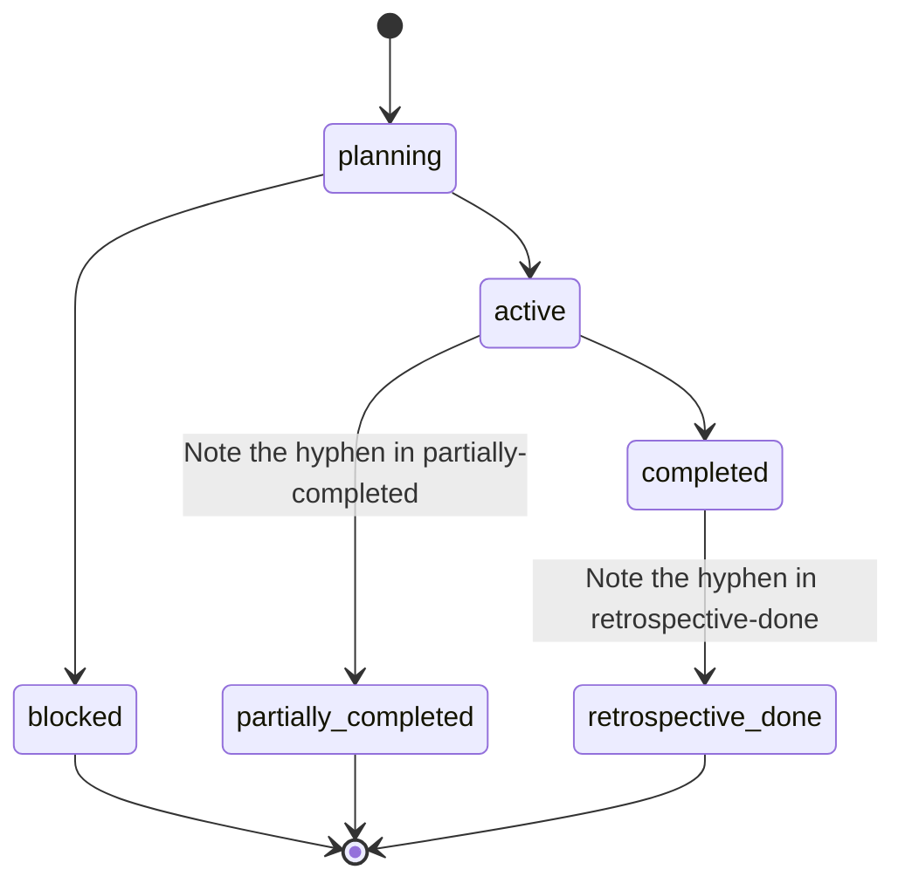

# Sprint

A **Sprint** is a bounded execution cycle that groups together multiple [Tasks](task.md) to be delivered as a coherent unit.

## Purpose

Sprints manage the cadence of delivery in Forge. They define what is being built *now*. Each Sprint maintains a localized artifact directory (`engineering/sprints/{SPRINT_ID}/`) containing the prompt documents for its tasks and a metadata file recording dependencies and state.

## Lifecycle

Sprints follow a strict workflow:

*(Note: Internal JSON schema uses hyphens in state names, e.g., `retrospective-done`, `partially-completed`.)*

For commands related to starting and managing sprints, see the [Commands Reference](../commands/INDEX.md).
