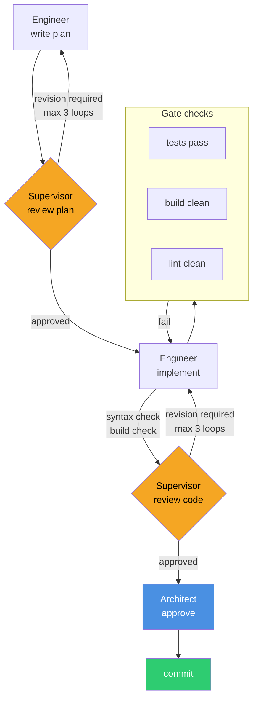
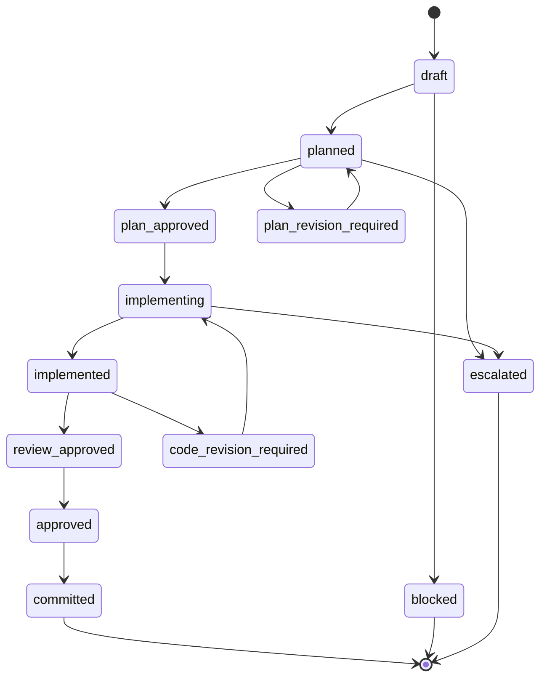

# Task

A **Task** is the fundamental atomic unit of work in Forge. Tasks represent single implementation steps that advance a [Sprint](sprint.md) toward its goal.

## Purpose

A Task bounds an agent's context. Tasks contain their own prompt (`TASK_PROMPT.md`) and are orchestrated through a rigid pipeline (Plan → Review → Implement → Code Review). A Task maps exactly to one workflow cycle and produces defined artifacts (e.g., `PLAN.md`).

## Pipeline

Every task in Forge runs through the same pipeline. It's not a convention — it's enforced by the orchestrator, which will not advance a phase until its gate checks pass.

**Revision loops:** if a review verdict is "Revision Required", the orchestrator routes back to the preceding phase. After 3 loops without approval, it escalates to you — it never auto-approves to unblock the pipeline.

**Gate checks** run automatically between implement and review. If the build is broken or tests fail, the error is passed back to the Engineer before the Supervisor ever sees the code.

## Lifecycle

Tasks go through a comprehensive review and implementation lifecycle:

*(Note: Internal JSON schema uses hyphens, e.g., `plan-approved`, `code-revision-required`.)*

For commands related to tasks, see the [Commands Reference](../commands/INDEX.md).
