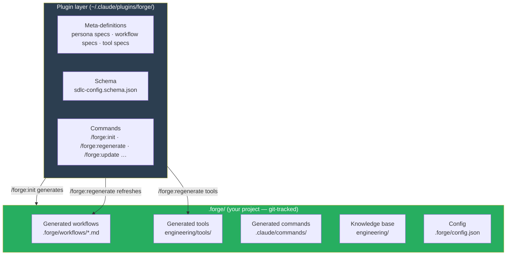
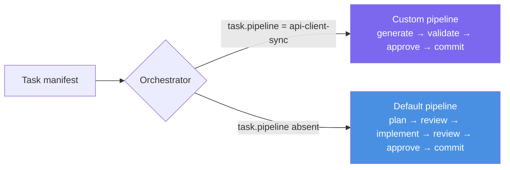
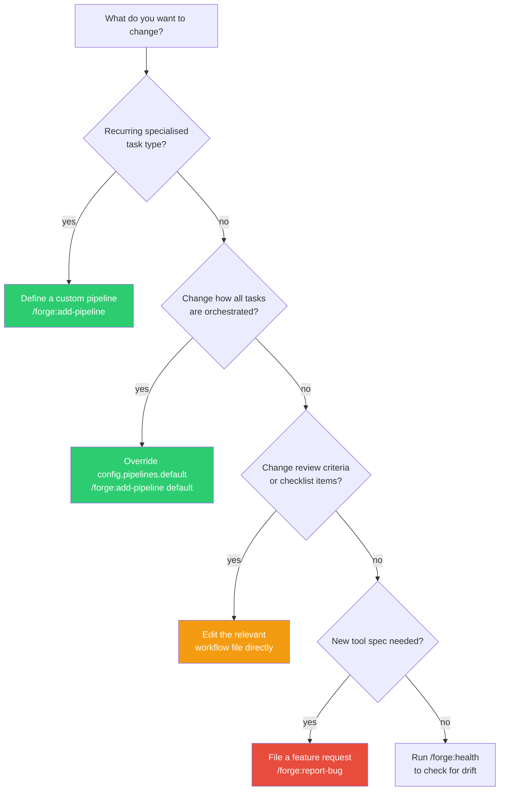

# Customising Forge Workflows

Forge generates a complete engineering practice from its meta-definitions. Everything it generates can be customised. This guide explains the customisation model, what to change at each layer, and how to keep your customisations in sync as Forge evolves.

---

## The customisation model

Forge has two distinct layers. Understanding which layer you're in determines how your changes behave.



**Plugin layer:** owned by Forge. Updated by `/plugin install`. Changes flow down when you run `/forge:regenerate` or `/forge:update`.

**Project layer:** owned by you. Git-tracked in your repo. You can edit these files directly — Forge will show diffs and ask before overwriting them.

---

## What you can customise and how

### 1. Custom pipelines — route tasks to specialised agents

The default pipeline (plan → review → implement → review → approve → commit) works for general engineering tasks. When you have a recurring specialised task type — generating typed API clients from a spec, running schema migrations, scaffolding integration stubs — the generic pipeline adds friction without value. You can define a dedicated pipeline for it.

**Example: generating a typed API client from an OpenAPI spec**

A team consuming a third-party API updates its generated client every time the upstream spec changes. The task is mechanical: the spec is the plan. There is nothing to design, no architecture to review. The useful steps are generation, spec-compliance validation, and commit.

The default pipeline forces a plan → review-plan cycle that produces no value here. A custom pipeline skips straight to generation:

```bash
/forge:add-pipeline api-client-sync
```

Forge will prompt you for:
- A **description** — used by the sprint planner to auto-assign this pipeline to matching tasks
- **Phases** — the slash commands to invoke, in order, each with a semantic role

```
command          role
generate-client  implement
validate-client  review-code
approve          approve
commit           commit
```

`generate-client` runs the OpenAPI code generator against the spec and writes the client files. `validate-client` checks the generated output against the spec for completeness and breaking changes, then approves or requests a retry. The revision loop is preserved — if the generated client is missing endpoints or has type errors, `validate-client` routes back to `generate-client` automatically (up to the configured `maxIterations`).

This writes the pipeline into `.forge/config.json`:

```json
{
  "pipelines": {
    "api-client-sync": {
      "description": "For tasks that regenerate typed API clients from an OpenAPI spec",
      "phases": [
        { "command": "generate-client", "role": "implement" },
        { "command": "validate-client", "role": "review-code" },
        { "command": "approve",         "role": "approve" },
        { "command": "commit",          "role": "commit" }
      ]
    }
  }
}
```

Then run `/forge:regenerate workflows` to wire the routing into the generated orchestrator.



Tasks can be assigned a pipeline explicitly (in the JSON manifest) or automatically — the sprint planner matches task descriptions against pipeline `description` fields during `/sprint-plan`.

To manage pipelines:

```bash
/forge:add-pipeline my-pipeline            # add or update
/forge:add-pipeline --list                 # list all configured pipelines
/forge:add-pipeline --remove my-pipeline   # remove (warns if tasks reference it)
```

---

### 2. Editing generated workflows directly

Generated workflows live in `.forge/workflows/`. They are plain Markdown — you can edit them directly.

Common reasons to edit:
- Tighten or loosen a review checklist item
- Add a project-specific gate check (e.g., a custom lint rule)
- Change the revision loop limit for a specific phase
- Add a domain-specific validation step before commit

**Safe pattern:** make surgical edits to specific sections rather than rewriting whole files. This makes it easier to review what changed and easier to reconcile with future Forge regeneration.

**What to avoid:** removing the Iron Laws section, disabling gate checks, or modifying the escalation triggers. These are there for a reason.

When Forge regenerates after you've edited a workflow, it will:
1. Show you a diff between your version and the freshly generated version
2. Ask which sections to keep

---

### 3. Overriding the default pipeline

To change the default pipeline for all tasks (not just a specific type), define a `default` entry in `config.pipelines`:

```bash
/forge:add-pipeline default
```

Example — remove the plan review phase for a team that does synchronous planning outside the tool:

```
command     role
implement   implement
supervisor  review-code
approve     approve
commit      commit
```

This overrides the hardcoded default pipeline for every task that doesn't declare a specific `pipeline` field.

---

### 4. Persona adjustments

Generated personas live embedded in each workflow file as the opening section. To adjust a persona — for example, to add a domain-specific constraint to the Supervisor's review criteria — edit the relevant workflow directly:

```bash
# Edit the review criteria in the Supervisor's workflow
.forge/workflows/supervisor_review_implementation.md
```

Add items to the checklist section. Remove items that don't apply to your domain. The Supervisor's persona is effectively its checklist — everything else follows from what it's told to check.

---

## Keeping customisations in sync with Forge updates

When Forge ships a new version, `/forge:update` applies the relevant migrations. For generated files you've edited, it will show a diff and ask what to keep.

```mermaid
flowchart TD
    U[/forge:update] --> M[Read migrations.json\ncompute delta from prev version]
    M --> R[Regenerate affected targets]
    R --> D{File has local edits?}
    D -->|yes| P[Show diff\nask user to decide per section]
    D -->|no| W[Write directly]
    P --> K[Keep your edits / take new version / merge manually]
    K --> Done
    W --> Done
```

**General rule:** customisations at the pipeline level (`config.json`) survive updates cleanly because the plugin never touches `config.json`. Customisations inside generated workflow files require a merge review on each update that touches those files.

If you find yourself editing the same generated file after every update, that's a signal the edit should be a pipeline definition or a meta-level contribution — file it as a feature request via `/forge:report-bug`.

---

## Customisation decision guide


