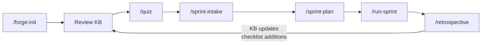
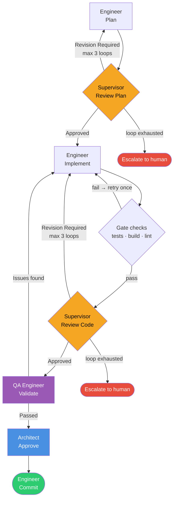
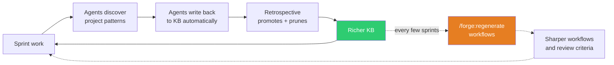

# The Default Flow

Forge follows one process. This page documents every step, who drives it, what goes in, what comes out, and what must pass before the next step starts.

---

## The Full Cycle



Each sprint follows this path. The retrospective feeds the knowledge base, which makes the next sprint sharper.

---

## Step 1: Initialize

**Command:** `/forge:init` or `/forge:init --fast`

**Who:** Forge (automated)

**Input:** Your codebase.

**Output:** A complete SDLC instance — knowledge base, personas, workflows, commands, tools, store.

Forge runs 12 automated phases:

| Phase | What happens |
|-------|-------------|
| 1. Discover | Reads your stack, routes, models, tests, CI config |
| 2. Marketplace Skills | Checks installed skills, recommends additions for your stack |
| 3. Knowledge Base | Generates architecture docs, entity model, review checklist |
| 4. Personas | Generates Engineer, Supervisor, Architect, and other identities |
| 5. Skills | Generates skill definitions wired to your stack |
| 6. Templates | Generates plan, review, and retrospective document formats |
| 7. Workflows | Generates agent workflows wired to your commands and paths |
| 8. Orchestration | Assembles the task pipeline and sprint scheduler |
| 9. Commands | Creates slash commands in `.claude/commands/` |
| 10. Tools | Generates deterministic tools in your project's language |
| 11. Smoke Test | Validates everything connects; self-corrects if needed |
| 12. Tomoshibi | Generates the concierge agent for project queries |

**Fast mode** (`--fast`) skips heavy generation phases and writes stubs instead. Stubs self-materialize on first use. Use fast mode when you want to start working immediately and let Forge build out as you go.

**Full mode** (`--full`) runs all 12 phases. This takes 10–15 minutes and requires no interaction.

**Time budget:** Full mode: 10–15 min (unattended). Fast mode: 2–3 min.

**Gate:** Smoke test must pass. If it fails, Forge self-corrects and re-runs.

---

## Step 2: Review the Knowledge Base

**Who:** You

**Input:** Generated `engineering/` directory.

**Output:** A corrected knowledge base with `[?]` markers resolved.

Forge marks uncertain lines with `[?]`. These are the only items that require your attention before the first sprint.

Review in this order:
1. **`entity-model.md`** — most important. Every other agent reads this.
2. **`stack.md`** — confirm your tech choices, versions, and patterns.
3. **`routing.md`** — verify your API conventions and auth strategy.
4. **`stack-checklist.md`** — add 3–5 project-specific review criteria.

**Time budget:** 30–45 minutes for an existing project. 60–90 minutes for a greenfield project.

---

## Step 3: Quiz

**Command:** `/quiz` or `/forge:quiz-agent`

**Who:** You and Forge

**Input:** The knowledge base.

**Output:** A corrected knowledge base. Forge patches it on the spot.

The quiz is a structured interview. You ask Forge about your project. If an answer is wrong or incomplete, say so. Forge uses that feedback to patch the knowledge base immediately.

```
/quiz
> What are the main entities in this project?
> How does authentication work?
> What does a typical API request flow look like?
```

This is the fastest way to validate and sharpen what Forge knows about your project.

After the quiz session, regenerate workflows so they reflect the corrected KB:

```bash
/forge:regenerate workflows
```

---

## Step 4: Sprint Intake

**Command:** `/sprint-intake`

**Who:** Product Manager persona

**Input:** Your intent for the sprint.

**Output:** `SPRINT_REQUIREMENTS.md` — structured requirements with acceptance criteria, edge cases, and out-of-scope items.

The Product Manager interviews you. It asks clarifying questions about scope, dependencies, and risk. It captures requirements in a structured format that the sprint planner can decompose into tasks.

**Gate:** Requirements must be unambiguous. Vague requirements produce vague plans.

---

## Step 5: Sprint Plan

**Command:** `/sprint-plan`

**Who:** Architect persona

**Input:** Sprint requirements.

**Output:** Task manifests with estimates, a dependency graph, and pipeline assignments.

The Architect breaks the requirements into tasks. Each task gets an estimate, a pipeline assignment, and dependency edges to other tasks. Independent tasks are grouped for parallel execution.

---

## Step 6: Run Sprint

**Command:** `/run-sprint SPRINT-ID`

**Who:** Orchestrator persona

**Input:** Task manifests and dependency graph.

**Output:** Committed code and artifacts.

The Orchestrator runs all tasks through the task pipeline, respecting dependency order. Independent tasks run in parallel waves.

### The Task Pipeline

Every task runs through this pipeline:



**Each phase has a purpose:**

| Phase | Persona | Why it exists |
|-------|---------|--------------|
| Plan | Engineer | Turns requirements into a verifiable implementation plan |
| Review Plan | Supervisor | Catches gaps, assumptions, and risks before any code is written |
| Implement | Engineer | Builds the plan. Runs tests. Documents what changed. |
| Gate Checks | Automated | Tests pass. Build succeeds. Lint is clean. No exceptions. |
| Review Code | Supervisor | Checks implementation against plan, checklist, and security criteria |
| Validate | QA Engineer | Verifies acceptance criteria are met. Runs targeted tests. |
| Approve | Architect | Final architectural sign-off. Checks for systemic risks. |
| Commit | Engineer | Stages artifacts. Creates a formatted commit. |

**Revision loops are not failures.** They are the mechanism that produces correct output. The Supervisor finds problems. The Engineer fixes them. By the third loop, the output is usually solid.

**Escalation is not a failure either.** When the revision loop exhausts, the Orchestrator stops and asks you to intervene. This is the correct behavior — continuing past an unresolved problem would produce broken code.

### Bug fixes

Bugs follow a separate pipeline with severity-based shortcuts:

| Severity | Pipeline |
|----------|----------|
| Critical | Implement → Review Code → Commit (skip plan, skip approve) |
| Major | Plan → Implement → Review Code → Approve → Commit (skip plan review) |
| Minor | Full pipeline |

### Custom pipelines

Tasks that need a different flow can use custom pipelines defined via `/forge:add-pipeline`. The sprint planner auto-assigns pipelines based on task descriptions, or you can assign them explicitly.

---

## Step 7: Retrospective

**Command:** `/retrospective SPRINT-ID`

**Who:** Architect persona

**Input:** All task manifests, event logs, and retrospective notes.

**Output:** Knowledge base updates, checklist additions, workflow improvement proposals, `COST_REPORT.md`.

The retrospective is the most important step in the cycle. It is what makes Forge self-improving.

**What happens:**

1. **Load context.** The Architect reads every task result, every review verdict, every event log.
2. **Analyze.** It identifies bottlenecks, common failure modes, and revision patterns.
3. **Update the knowledge base.** It patches architecture docs, domain docs, and the stack checklist based on what was learned.
4. **Finalize.** Sprint status moves to `retrospective-done`. Event data is consolidated into `COST_REPORT.md`. Raw events are purged.

**Pattern signals the Architect watches for:**

| Signal | Meaning |
|--------|---------|
| Many plan revision loops | Acceptance criteria are underspecified |
| Many code review loops | Engineer deviated from plan |
| Recurring review feedback | Candidate for stack-checklist |
| Recurring bug root causes | Candidate for preventive checks |

`[?]` markers in the KB are reviewed during retrospective. Confirmed entries are cleaned up. Patterns appearing in 2+ sprints are promoted to the stack checklist.

---

## The Knowledge Flywheel



Two things evolve: the **knowledge base** and the **generated workflows**. They update through different mechanisms.

- **Knowledge base:** updates automatically after every sprint. The Supervisor adds review patterns. The Bug Fixer tags root causes. The Retrospective promotes and prunes.
- **Generated workflows:** update only when you explicitly run `/forge:regenerate workflows`. Regenerate every few sprints, or after a retrospective that revealed significant patterns.

By Sprint 3–4, the KB is substantially richer than at init. A workflow regeneration at that point produces review criteria and pipelines that reflect what Forge has learned about your project.

---

## Fast Mode vs Full Mode

| | Full mode | Fast mode |
|---|---|---|
| **When to use** | First init on a real project | Quick start, prototypes, experimentation |
| **Phases** | All 12 | Phases 1–3 (skeleton), 7–12 (stubs) |
| **KB** | Full docs with confidence ratings | Minimal skeleton |
| **Workflows** | Full workflow files | Stub files (self-materialize on first use) |
| **Time** | 10–15 min | 2–3 min |
| **After init** | Review `[?]` markers, then sprint | Run `/forge:materialize` when you need full docs |

Fast mode is a valid starting point. Stubs are not a degraded state — they are workflows waiting to be born. When you invoke a stubbed workflow for the first time, Forge materializes it from the meta-definitions, using the KB as it exists at that moment (which is richer than what existed at init time).

You can promote from fast to full at any time:

```bash
/forge:config mode full
/forge:materialize
```

This is a one-way operation. There is no `full` → `fast` downgrade.