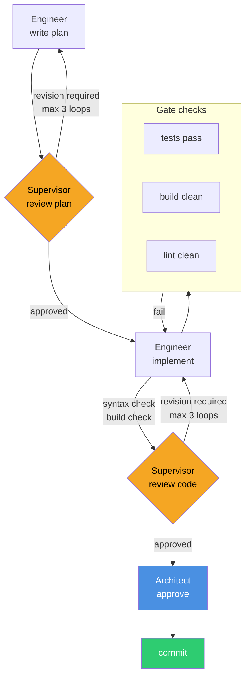
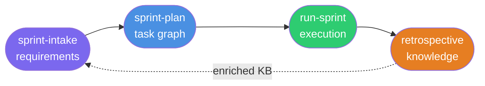
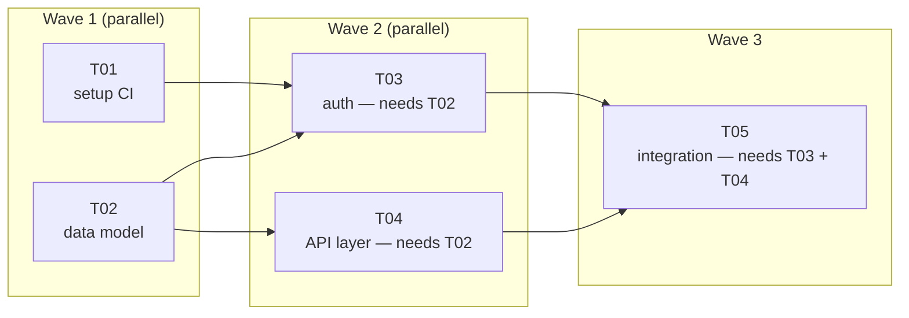

# Using Forge with Default Workflows

The default Forge setup gives you a complete engineering practice out of the box — structured sprint planning, multi-role code review, automated orchestration, and a self-improving knowledge base. This guide covers how that practice works day-to-day, what each command does, and how to maintain the system over time.

---

## The pipeline

Every task in Forge runs through the same pipeline. It's not a convention — it's enforced by the orchestrator, which will not advance a phase until its gate checks pass.



**Revision loops:** if a review verdict is "Revision Required", the orchestrator routes back to the preceding phase. After 3 loops without approval, it escalates to you — it never auto-approves to unblock the pipeline.

**Gate checks** run automatically between implement and review. If the build is broken or tests fail, the error is passed back to the Engineer before the Supervisor ever sees the code.

---

## The sprint lifecycle

A sprint in Forge follows four commands, in order:



### `/sprint-intake` — capture requirements

The Architect interviews you with structured questions: what's in scope, what's blocked, what decisions are open. The output is a `SPRINT_REQUIREMENTS.md` in `engineering/sprints/SPRINT_ID/`.

You cannot run `/sprint-plan` without a completed requirements document — the planner enforces this.

```bash
/sprint-intake
```

### `/sprint-plan` — break requirements into tasks

The Architect reads the requirements document, your knowledge base, and the previous sprint's retrospective, then produces:
- Task manifests in `.forge/store/tasks/`
- A sprint manifest in `.forge/store/sprints/`
- A dependency graph — tasks that depend on others are blocked until their prerequisites are committed
- Task prompt files in `engineering/sprints/SPRINT_ID/`

```bash
/sprint-plan
```

Review the generated tasks before running the sprint. Add, remove, or adjust — the manifests are plain JSON files.

### `/run-sprint` — execute

The orchestrator executes all tasks, respecting the dependency graph. Independent tasks run in waves; tasks within a wave can run in parallel (if configured).



```bash
/run-sprint S01
```

To resume a sprint after an interruption:

```bash
/run-sprint S01 --resume
```

To run a single task manually instead of the full sprint:

```bash
/run-task PROJ-S01-T03
```

### `/retrospective` — close and learn

The Retrospective agent reads all sprint artifacts — plans, code reviews, escalations, bugs — and updates the knowledge base:

- Adds new patterns to `stack-checklist.md`
- Updates `entity-model.md` with anything that diverged from the plan
- Tags root causes in bug records
- Promotes successful patterns, flags recurring problems

```bash
/retrospective S01
```

This step is what makes Forge self-improving. Skipping it is possible but leaves the knowledge base stale.

---

## Day-to-day command reference

| Command | When to use it |
|---|---|
| `/sprint-intake` | Start of each sprint |
| `/sprint-plan` | After intake, once requirements are documented |
| `/run-sprint SPRINT-ID` | Execute the sprint |
| `/run-task TASK-ID` | Drive a single task when you don't want to run the full sprint |
| `/fix-bug BUG-ID` | Triage and fix a filed bug — runs a dedicated bug-fix pipeline |
| `/retrospective SPRINT-ID` | End of each sprint |
| `/quiz` | Validate or correct what Forge knows about your project |
| `/forge:health` | Check for stale docs, orphaned entities, skill gaps |

---

## Maintenance cadence

Forge is a living system. These are the maintenance operations and when to run them.

```mermaid
flowchart TD
    E[Every sprint] --> RS[/retrospective]

    P[Periodically\nor after major changes] --> H[/forge:health]
    H --> |stale docs detected| RK[/forge:regenerate\nknowledge-base]

    U[When Forge updates] --> PI[/plugin install\nEntelligentsia/forge]
    PI --> FU[/forge:update]

    RK --> RW[/forge:regenerate\nworkflows]
    RW --> |if tools changed| RT[/forge:regenerate tools]
```

### After major codebase changes

Run `/forge:health` to detect drift between the knowledge base and the actual code:

```bash
/forge:health
```

Common findings and responses:

| Health finding | Response |
|---|---|
| Orphaned entities (in code, not in KB) | `/forge:regenerate knowledge-base business-domain` |
| New subsystems not in architecture docs | `/forge:regenerate knowledge-base architecture` |
| New libraries not in stack checklist | `/forge:regenerate knowledge-base stack-checklist` |
| Stale workflows (after KB enrichment) | `/forge:regenerate workflows` |

### After a Forge plugin update

```bash
# You'll see this at session start when an update is available:
# "Forge 0.4.0 available. Run: /plugin install Entelligentsia/forge"

/plugin install Entelligentsia/forge
/forge:update       # Applies migrations — regenerates only what changed
```

`/forge:update` reads the migration manifest and runs only the regeneration targets affected by the version bump. It does not do a full rebuild unless the migration requires it.
