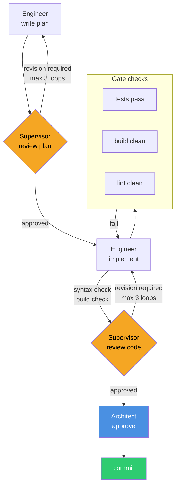
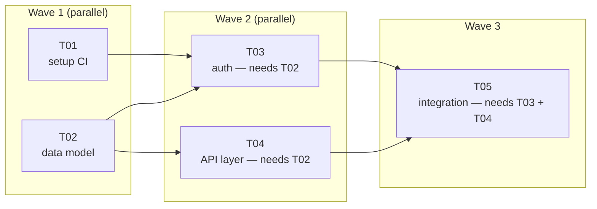
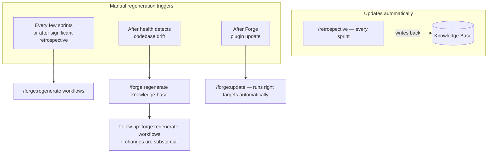

# Using Forge with Default Workflows

The default Forge setup gives you a complete engineering practice out of the box — structured sprint planning, multi-role code review, automated orchestration, and a self-improving knowledge base. This guide covers how that practice works day-to-day, what each command does, and how to maintain the system over time.

---

## The pipeline

Every task in Forge runs through the same pipeline. It's not a convention — it's enforced by the orchestrator, which will not advance a phase until its gate checks pass.



**Revision loops:** if a review verdict is "Revision Required", the orchestrator routes back to the preceding phase. After 3 loops without approval, it escalates to you — it never auto-approves to unblock the pipeline.

**Gate checks** run automatically between implement and review. If the build is broken or tests fail, the error is passed back to the Engineer before the Supervisor ever sees the code.

---

## The sprint lifecycle

A sprint in Forge follows four commands, in order:


### `/sprint-intake` — capture requirements

The Architect interviews you with structured questions: what's in scope, what's blocked, what decisions are open. The output is a `SPRINT_REQUIREMENTS.md` in `engineering/sprints/SPRINT_ID/`.

You cannot run `/sprint-plan` without a completed requirements document — the planner enforces this.

```bash
/sprint-intake
```

### `/sprint-plan` — break requirements into tasks

The Architect reads the requirements document, your knowledge base, and the previous sprint's retrospective, then produces:
- Task manifests in `.forge/store/tasks/`
- A sprint manifest in `.forge/store/sprints/`
- A dependency graph — tasks that depend on others are blocked until their prerequisites are committed
- Task prompt files in `engineering/sprints/SPRINT_ID/`

```bash
/sprint-plan
```

Review the generated tasks before running the sprint. Add, remove, or adjust — the manifests are plain JSON files.

### `/run-sprint` — execute

The orchestrator executes all tasks, respecting the dependency graph. Independent tasks run in waves; tasks within a wave can run in parallel (if configured).



```bash
/run-sprint S01
```

To resume a sprint after an interruption:

```bash
/run-sprint S01 --resume
```

To run a single task manually instead of the full sprint:

```bash
/run-task PROJ-S01-T03
```

### `/retrospective` — close and learn

The Retrospective agent reads all sprint artifacts — plans, code reviews, escalations, bugs — and updates the knowledge base:

- Adds new patterns to `stack-checklist.md`
- Updates `entity-model.md` with anything that diverged from the plan
- Tags root causes in bug records
- Promotes successful patterns, flags recurring problems

```bash
/retrospective S01
```

This step is what makes Forge self-improving. Skipping it is possible but leaves the knowledge base stale.

The retrospective updates the **knowledge base** automatically. It does not update the generated **workflows** — those are a snapshot that only changes when you explicitly regenerate them. After a retrospective that surfaces significant new patterns (new architectural constraints, new review criteria, new entity relationships), propagate those changes into the workflows:

```bash
/forge:regenerate workflows
```

You don't need to do this every sprint — once every few sprints, or when the retrospective reveals something substantial, is the right cadence.

---

## Day-to-day command reference

| Command | When to use it |
|---|---|
| `/sprint-intake` | Start of each sprint |
| `/sprint-plan` | After intake, once requirements are documented |
| `/run-sprint SPRINT-ID` | Execute the sprint |
| `/run-task TASK-ID` | Drive a single task when you don't want to run the full sprint |
| `/fix-bug BUG-ID` | Triage and fix a filed bug — runs a dedicated bug-fix pipeline |
| `/retrospective SPRINT-ID` | End of each sprint |
| `/quiz` | Validate or correct what Forge knows about your project |
| `/forge:health` | Check for stale docs, orphaned entities, skill gaps |

---

## Maintenance cadence

Two things evolve over a project's lifetime: the **knowledge base** (KB) and the **generated workflows**. They update through different mechanisms and on different schedules.



### Knowledge base vs workflow regeneration — when each applies

| Situation | What to run |
|---|---|
| Every sprint — always | `/retrospective` (auto-updates KB) |
| Every few sprints, or retrospective revealed major new patterns | `/forge:regenerate workflows` |
| Health detects orphaned entities | `/forge:regenerate knowledge-base business-domain` |
| Health detects new subsystems in code | `/forge:regenerate knowledge-base architecture` |
| Health detects new libraries | `/forge:regenerate knowledge-base stack-checklist` |
| KB was just refreshed and changes were substantial | `/forge:regenerate workflows` (follow-up) |
| New Forge plugin version available | `/plugin install forge@skillforge` then `/forge:update` |
| New tool spec added (e.g. after Forge update) | `/forge:regenerate tools` (or handled by `/forge:update`) |

### After major codebase changes

```bash
/forge:health
```

Health detects drift between the KB and the actual code. After applying the indicated `regenerate knowledge-base` command, judge whether the KB changes were substantial enough to warrant a workflow regeneration. New entities and minor additions usually aren't; new subsystems, new auth patterns, or new review-critical libraries usually are.

### After a Forge plugin update

```bash
/plugin install forge@skillforge
/forge:update       # reads migration manifest, runs only the affected targets
```

`/forge:update` handles the regeneration decisions automatically — it knows which targets each version bump requires. You don't need to run `regenerate` manually after an update.
