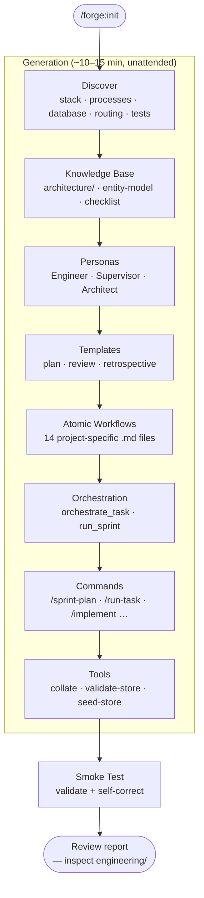
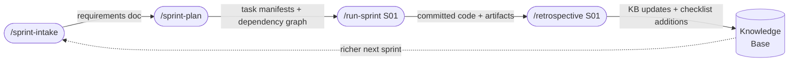
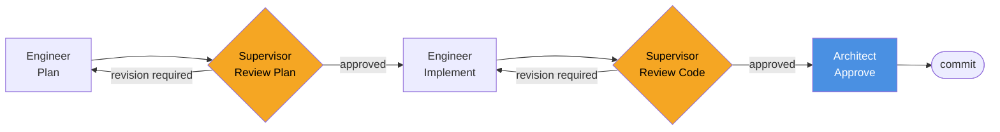
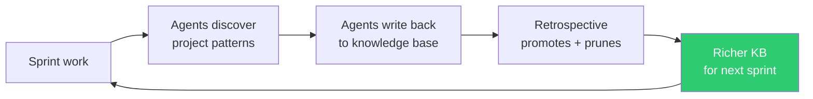

# Onboarding an Existing Codebase

Forge is discovery-driven. The more code there is to read, the more accurate the generated knowledge base, personas, and workflows will be. An existing project is Forge's best-case scenario.

---

## What happens during `/forge:init`

Forge runs 9 automated phases — no interaction needed until the smoke test report.



**Discovery reads your actual code**, not config files you fill in:

| Discovery pass | What it reads | What it produces |
|---|---|---|
| Stack | `package.json`, `pyproject.toml`, `go.mod`, `Dockerfile`, `Makefile` | Language, framework, versions |
| Processes | `docker-compose.yml`, CI configs, Procfile, systemd units | Service topology, build/deploy commands |
| Database | ORM model files, schema files, migration directories | Entity inventory, relationships, field types |
| Routing | Route definitions, middleware, auth decorators | API surface, auth strategy |
| Testing | Test directories, CI config, test scripts | Test command, build command, lint command |

---

## After init — review the knowledge base

Forge marks uncertain lines with `[?]`. These are the only things that require your attention before the first sprint.

```
engineering/
  architecture/
    stack.md          ← review detected versions and frameworks
    database.md       ← check entity relationships, field types
    routing.md        ← verify auth strategy and route groupings
    processes.md      ← confirm service boundaries
    deployment.md     ← check CI/CD pipeline details
  business-domain/
    entity-model.md   ← most important: verify entity fields and relationships
  stack-checklist.md  ← review initial review criteria — add project-specific items
```

Each doc includes a confidence header:

```markdown
<!-- AUTO-GENERATED by /forge:init — confidence: 72%
     Review and correct before first sprint.
     Lines marked [?] need human verification. -->
```

Use `/quiz` to interactively interrogate what Forge knows. If an answer is wrong or incomplete, say so — Forge patches the knowledge base on the spot.

```
/quiz
> What are the main entities in this project?
> How does authentication work?
> What does a typical API request flow look like?
```

**Time budget:** 30–45 minutes of human review is typical. Projects with complex entity models or non-standard auth patterns take longer.

---

## Your first sprint

Once the knowledge base looks accurate:



```bash
/sprint-intake       # Architect interviews you; produces SPRINT_REQUIREMENTS.md
/sprint-plan         # Breaks requirements into tasks with estimates and dependencies
/run-sprint S01      # Executes all tasks in dependency waves
/retrospective S01   # Closes the sprint; agents write back what they learned
```

Each task in the sprint runs through the full pipeline automatically:



If you prefer to drive individual tasks manually:

```bash
/run-task PROJ-S01-T03
```

---

## The knowledge flywheel

Forge gets more accurate with every sprint, automatically.



Specifically, after each sprint:
- The **Supervisor** adds new patterns to `stack-checklist.md` when it catches something worth catching again
- The **Bug Fixer** tags root causes and builds preventive checks
- The **Retrospective agent** promotes what worked and retires what didn't

By Sprint 3–4, the system understands your project better than any static prompt ever could.

---

## Keeping Forge current

Run `/forge:health` periodically — after major feature additions or architectural changes:

```bash
/forge:health        # Detects stale docs, orphaned entities, coverage gaps
```

When health flags drift, refresh the affected knowledge base category:

```bash
/forge:regenerate knowledge-base business-domain   # New entities added
/forge:regenerate knowledge-base architecture      # New subsystems or services
/forge:regenerate knowledge-base stack-checklist   # New libraries adopted
```

When a new Forge version is available (you'll see a nudge at session start):

```bash
/plugin install Entelligentsia/forge
/forge:update        # Propagates plugin changes into your project's generated artifacts
```
