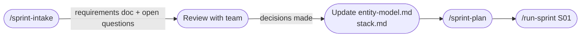

# Starting a New Project with Forge

Running Forge on a greenfield project works — but the experience is different from onboarding an existing codebase. Less code means less to discover, which means lower initial confidence and a sparser knowledge base. That's expected and manageable.

This guide explains what to do before init, what to expect after it, and how to get the knowledge base to a useful state quickly.

---

## Before running `/forge:init`

The more Forge can read, the better it generates. On a new project, you control what exists at init time.

**Minimum useful state:**

```
project/
  package.json / pyproject.toml / go.mod   ← stack detection
  Dockerfile or docker-compose.yml         ← process topology
  README.md                                ← project description (optional but helpful)
```

**Better state — set up these before init if you can:**

| What to create | Why it helps |
|---|---|
| At least one model/entity file | Gives database discovery something to read — produces a real entity model |
| A route file or API skeleton | Lets routing discovery map your auth strategy and URL structure |
| A test directory with a sample test | Gives testing discovery the test command and framework |
| A CI config (GitHub Actions, etc.) | Lets process discovery understand your build pipeline |
| A migration directory | Helps database discovery detect the ORM and migration pattern |

You don't need working code. Scaffolded files with the right structure are enough for Forge to infer your intended patterns.

---

## What init produces on a greenfield project

```mermaid
flowchart TD
    A([/forge:init]) --> B[Discover\nreads what exists]
    B --> C{How much\nwas found?}

    C -->|Rich scaffolding| D[High confidence\n~70-85%\nfew question marks]
    C -->|Minimal files| E[Lower confidence\n~40-60%\nmany question marks]

    D --> F[Knowledge Base\nautomatically useful]
    E --> G[Knowledge Base\nneeds manual bootstrapping]

    F --> H([Review [?] items\n~30 min])
    G --> I([Expand KB manually\n~60-90 min])

    H --> J([First sprint])
    I --> J
```

The confidence rating appears in each generated doc:

```markdown
<!-- AUTO-GENERATED by /forge:init — confidence: 45%
     Review and correct before first sprint.
     Lines marked [?] need human verification. -->
```

A 45% confidence doc is not a failure — it's Forge telling you exactly where it needs help.

---

## Bootstrapping the knowledge base manually

On a greenfield project, `entity-model.md` and the architecture docs will have significant `[?]` coverage. The fastest way to fill those gaps is `/quiz`:

```bash
/quiz
```

Treat it as a structured interview where you correct Forge's assumptions:

```
Forge: The entity model shows User with fields: id, email, password_hash, created_at.
       Is this accurate?

You:   Yes, but also add: role (enum: admin/member/viewer), workspace_id (FK → Workspace),
       and last_login_at.

Forge: [updates entity-model.md on the spot]
```

Work through the knowledge base systematically in this order:

1. **`entity-model.md`** — most important; every other agent reads this
2. **`stack.md`** — confirm your tech choices, versions, and patterns
3. **`routing.md`** — define your API conventions and auth strategy
4. **`stack-checklist.md`** — add 3–5 project-specific review criteria from day 1

**Time budget:** 60–90 minutes for a typical greenfield project with minimal scaffolding.

---

## Using Forge to structure day-1 decisions

Before your first sprint, you can use Forge to think through architectural decisions — not just execute them.

```bash
/sprint-intake
```

The Architect doesn't just capture requirements — it asks clarifying questions about scope, dependencies, and risk. On a greenfield project this is especially useful: Sprint 1 requirements often reveal missing architectural decisions.



Update `entity-model.md` and `stack.md` with any decisions made during intake before running `/sprint-plan`. The Architect reads those docs when creating task estimates.

---

## Sprint 1 on a greenfield project

Sprint 1 tasks on a greenfield project are typically foundational:

```
S01-T01  Set up project structure and CI
S01-T02  Implement authentication
S01-T03  Define core data model and migrations
S01-T04  Scaffold API routing layer
```

The orchestrator runs each task through the full plan → review → implement → review → approve → commit pipeline. Even on Sprint 1, the Supervisor's review is valuable — it catches assumptions made during planning that don't survive implementation.

After Sprint 1:

```bash
/retrospective S01
```

The retrospective agent reads what was built and updates the knowledge base with what it learned. By the end of Sprint 1, the KB is significantly richer than at init — even on a greenfield project.

---

## The knowledge curve

```
Knowledge Base accuracy

100% ┤                                           ╭────────
     │                                      ╭───╯
     │                              ╭───────╯
 60% ┤                     ╭────────╯
     │            ╭────────╯
     │       ─────╯
 20% ┤──────╯
     │
     └───────────────────────────────────────────────────
     Init   Quiz   S01    S02    S03    S04   Steady state
```

Greenfield projects start lower but converge to the same steady state as existing projects. The quiz session and Sprint 1 retrospective are the two biggest jumps.
