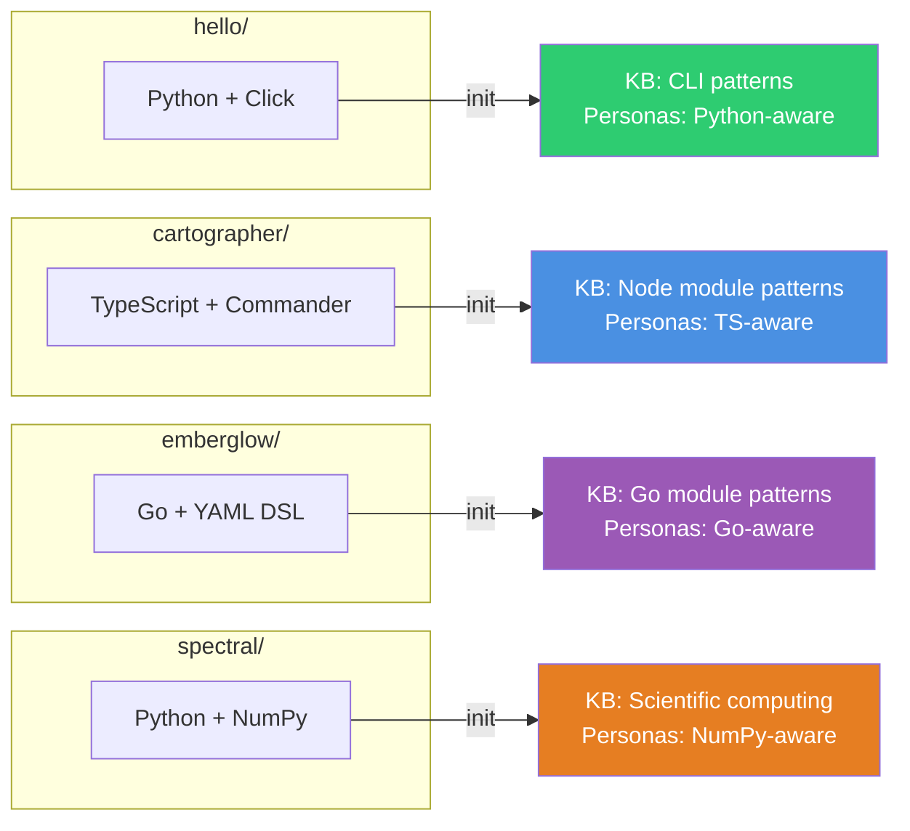

# Onboarding with Testbench

The fastest way to learn Forge is to run it on a sandbox project where you can break nothing. [forge-testbench](https://github.com/Entelligentsia/forge-testbench) provides four small projects across three stacks, ready for Forge initialization.

---

## Prerequisites

- [Claude Code](https://claude.ai/code) v1.0.33+
- Forge installed: `/plugin install forge@skillforge`

---

## Clone and Setup

```bash
git clone https://github.com/Entelligentsia/forge-testbench.git
cd forge-testbench
```

The repo contains four projects:

| Project | Stack | Status |
|---------|-------|--------|
| **hello/** | Python + Click | Ready for init |
| **cartographer/** | TypeScript + Commander | Ready for init |
| **emberglow/** | Go + YAML DSL | Ready for init |
| **spectral/** | Python + NumPy | Ready for init |

Each project is a small, real application. Forge reads the actual code and generates a project-specific SDLC from it.

---

## Walkthrough: hello/

The `hello/` project is the simplest entry point — 26 lines of Python with a Click CLI. It is small enough that Forge generates quickly, and the output is easy to review.

### Step 1: Initialize

```bash
cd hello
/forge:init --fast
```

Fast mode runs in 2–3 minutes. It generates the directory structure, config, stubs, and commands without the full knowledge base generation.

**What you get:**

```
hello/
├── .forge/
│   ├── config.json                  ← auto-detected: Python 3.11+, click, hatchling
│   ├── workflows/                   ← 18 workflows (stubs → full on first use)
│   ├── schemas/                     ← JSON schemas for store validation
│   ├── personas/                    ← (stubs, materialize on first use)
│   ├── skills/                      ← (stubs, materialize on first use)
│   └── store/                       ← empty store (sprints, tasks, bugs, events)
├── .claude/commands/hello/          ← 14 project-scoped slash commands
└── hello-project-knowledge/
    ├── MASTER_INDEX.md              ← KB index (skeleton — grows with sprints)
    ├── architecture/
    │   └── stack.md                  ← generated from pyproject.toml + hello.py
    └── business-domain/
        └── entity-model.md
```

### Step 2: Review the config

```bash
/forge:config
```

Check that the auto-detected stack matches your project. Forge reads `pyproject.toml` and `hello.py` to determine the language, framework, and test commands. If anything is wrong, correct it now — every downstream agent reads this config.

### Step 3: Quiz the knowledge base

```bash
/hello:quiz-agent
```

The quiz asks 5–7 questions about your project, drawn from the KB docs. Answer them. If Forge gets something wrong, say so — it patches the KB immediately.

This step is short on `hello/` because the project is small. On a real project, the quiz takes 10–20 minutes and substantially sharpens the KB.

### Step 4: Sprint intake

```bash
/hello:sprint-intake
```

The Product Manager persona interviews you. It asks about scope, dependencies, and risk. It produces a `SPRINT_REQUIREMENTS.md` document with acceptance criteria, edge cases, and out-of-scope items.

For `hello/`, try a simple sprint: adding a `--goodbye` flag to the CLI.

### Step 5: Sprint plan

```bash
/hello:sprint-plan
```

The Architect breaks the requirements into tasks. Each task gets an estimate and dependency edges. Independent tasks are grouped for parallel execution.

### Step 6: Run a task

```bash
/hello:run-task HELLO-S01-T01
```

The Orchestrator drives the task through the full pipeline: plan → review plan → implement → review code → validate → approve → commit.

Watch each phase. The Engineer writes a plan. The Supervisor reviews it. If the plan has gaps, the Engineer revises. Once approved, the Engineer implements. The Supervisor reviews the code. Once approved, the Architect signs off. Then the Engineer commits.

---

## Try the Other Projects

Each project demonstrates how Forge adapts to a different stack:



Initialize each project to compare how Forge generates different knowledge bases, personas, and review criteria:

```bash
cd cartographer && /forge:init --fast
cd ../emberglow && /forge:init --fast
cd ../spectral && /forge:init --fast
```

Compare the generated `.forge/config.json`, `engineering/stack-checklist.md`, and `.forge/workflows/` across projects. The review criteria, persona knowledge, and workflow details all change based on the stack.

---

## Branch Reference

The testbench repo has two branches:

| Branch | What it shows |
|--------|--------------|
| `main` | Clean starting state. Onboarding guide. All projects un-initialized. |
| `forge-initialized` | Reference snapshot after `/forge:init --fast` + first sprint intake on `hello/`. |

Switch to `forge-initialized` to see what Forge produces without running init yourself:

```bash
git checkout forge-initialized
```

This branch shows the artifact structure, generated files, and sprint state after two Forge operations. It is a reference, not a working Forge instance — you still need Forge installed to run commands.

---

## Next Steps

- **Try full mode:** `/forge:init --full` on any project. Compare the output with fast mode. Full mode generates the complete knowledge base in one pass.
- **Customize workflows:** Edit `.forge/workflows/` files to match your team's review criteria. See [Customising Workflows](customising-workflows.md).
- **Read the philosophy:** Understand why Forge enforces the verification chain. See [Philosophy](philosophy.md).
- **Follow the default flow:** See the complete sprint lifecycle with all verification gates. See [Default Flow](default-flow.md).
- **Command reference:** Every command documented with inputs, outputs, and gate checks. See [Commands](commands/index.md).