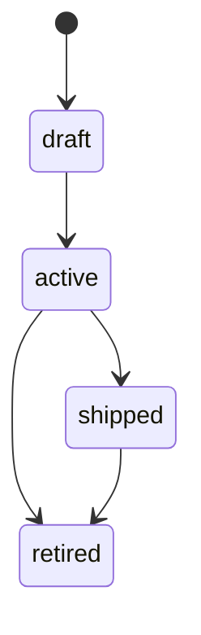

# Store Schema: Feature

## File Location

`.forge/store/features/{FEATURE_ID}.json`

## Fields

| Field | Type | Required | Description |
|-------|------|----------|-------------|
| `id` | string | yes | Format: `FEAT-NNN` |
| `title` | string | yes | Feature title |
| `description` | string | no | Feature description |
| `status` | enum | yes | See status values below |
| `requirements` | string[] | no | Plain-text requirement lines |
| `sprints` | string[] | no | Array of sprint IDs (back-refs) |
| `tasks` | string[] | no | Array of task IDs (back-refs) |
| `created_at` | string | yes | ISO date-time string |
| `updated_at` | string | no | ISO date-time string |

## Relationship Notes

- The fields `description`, `requirements`, `sprints`, `tasks`, and `updated_at` are **optional**.
- The `id`, `title`, `status`, and `created_at` fields are **required**.
- `feature_id` on sprint and task manifests is nullable for backwards compatibility.

## Status Values

