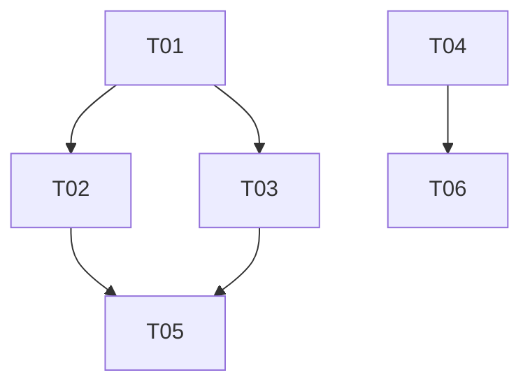

# 09 — Orchestration

How tasks and sprints are executed: the configurable pipeline and the dependency-aware scheduler.

---

## Two Levels of Orchestration

| Orchestrator | Scope | What It Does |
|-------------|-------|-------------|
| **run-task** | Single task | Drives one task through the lifecycle: Plan → Review → Implement → Review → Approve → Commit |
| **run-sprint** | Full sprint | Resolves task dependencies, manages worktrees, schedules tasks (sequentially or in parallel), handles failures, triggers post-sprint lifecycle |

Both are generated from meta-definitions. The generated versions contain project-specific commands, paths, gate conditions, and model selections.

---

## run-task — The Task Pipeline

### Pipeline Shape

The default pipeline is a sequence of **phases**, each with a defined agent, workflow, gate condition, and revision loop:

```
Plan ──→ Review Plan ──→ Implement ──→ Review Code ──→ Approve ──→ Writeback ──→ Commit
              ↑ loop (max 3)                 ↑ loop (max 3)
```

This shape is universal — plan-before-code and review-before-merge are good practice regardless of stack. What varies is everything inside each phase.

### Phases as Configurable Units

Each phase has properties that the meta-orchestrate defines abstractly and the generated orchestrator fills in concretely:

```
phase:
  name:               plan
  agent:              engineer
  model:              sonnet
  workflow:           engineer_plan_task.md
  produces:           PLAN.md
  skip_when:          (optional — conditions to bypass this phase)

phase:
  name:               review-plan
  agent:              supervisor
  model:              opus
  workflow:           supervisor_review_plan.md
  requires:           PLAN.md
  produces:           PLAN_REVIEW.md
  max_iterations:     3
  revision_workflow:  engineer_update_plan.md
  verdict_field:      "Verdict:"
  approved_values:    ["Approved"]

phase:
  name:               implement
  agent:              engineer
  model:              sonnet
  workflow:           engineer_implement_plan.md
  requires:           PLAN_REVIEW.md (verdict: Approved)
  produces:           PROGRESS.md
  gate_checks:
    - file_exists: PROGRESS.md
    - section_present: "## Testing Results"
    - command: {TEST_COMMAND}

phase:
  name:               review-implementation
  agent:              supervisor
  model:              opus
  workflow:           supervisor_review_implementation.md
  requires:           PROGRESS.md
  produces:           CODE_REVIEW.md
  max_iterations:     3
  revision_workflow:  engineer_update_implementation.md
  verdict_field:      "Verdict:"
  approved_values:    ["Approved", "Approved with supervisor corrections"]

phase:
  name:               approve
  agent:              architect
  model:              opus
  workflow:           architect_approve.md
  requires:           CODE_REVIEW.md (verdict: Approved)
  produces:           ARCHITECT_APPROVAL.md

phase:
  name:               writeback
  agent:              system
  description:        Verify knowledge writebacks were persisted
  checks:
    - task store has knowledgeUpdates field populated
    - if no writebacks and task touched new patterns, flag for retrospective

phase:
  name:               commit
  agent:              engineer
  model:              haiku
  workflow:           engineer_commit_task.md
  requires:           ARCHITECT_APPROVAL.md
```

### Pipeline Customisation

Teams customise the pipeline through `.forge/config.json` or by editing the generated orchestrator directly:

**Lightweight pipeline** (solo developer, fast iteration):

```json
{
  "pipeline": {
    "skipPhases": ["review-plan", "approve"],
    "maxReviewIterations": 1
  }
}
```

Produces: `Plan → Implement → Review Code → [1 iteration] → Commit`

**Heavy pipeline** (security-critical, regulated):

```json
{
  "pipeline": {
    "additionalPhases": [
      {
        "name": "security-review",
        "after": "review-implementation",
        "agent": "supervisor",
        "workflow": "security_review.md",
        "model": "opus"
      }
    ],
    "maxReviewIterations": 5
  }
}
```

Produces: `Plan → Review Plan → Implement → Review Code → Security Review → Approve → Commit`

**Bug fix pipeline** (streamlined for urgency):

The orchestrator already handles this — when the task type is a bug fix, certain phases are modified or skipped based on severity:

```
Critical bug: Implement → Review Code → Commit (skip planning, skip approval)
Major bug:    Plan → Implement → Review Code → Approve → Commit (skip plan review)
Minor bug:    Full pipeline (through /run-task as normal)
```

### Gate Conditions

Gates are the checkpoints between phases. The meta-orchestrate defines gate types; the generated orchestrator fills in concrete checks:

| Gate Type | Meta-Definition | Maya's Project | WalkInto |
|-----------|----------------|----------------|----------|
| File exists | `produces: PLAN.md` | Same | Same |
| Verdict extraction | `verdict_field: "Verdict:"` | Same | Same |
| Syntax verification | `{SYNTAX_CHECK}` | `python -m py_compile {file}` | `node --check {file}` |
| Test suite | `{TEST_COMMAND}` | `pytest && npm test` | `node routes/Tests/{file}.js` |
| Build check | `{BUILD_COMMAND} if frontend changed` | `npm run build` | `grunt build` |
| Migration check | Project-specific | `python manage.py makemigrations --check` | (none) |
| Lint check | `{LINT_COMMAND}` | `ruff check . && eslint src/` | (none) |

### Error Recovery

Rather than halting on every failure, the orchestrator applies graduated recovery:

| Failure Type | Detection | Recovery | Fallback |
|-------------|-----------|----------|----------|
| Test failure | Test command exits non-zero | Pass error output to Engineer revision workflow, retry once | Escalate |
| Build failure | Build command exits non-zero | Pass error output to Engineer revision workflow, retry once | Escalate |
| Syntax error | Syntax check exits non-zero | Auto-fix is part of the Engineer workflow (already happens) | Escalate |
| Verdict: Revision Required | Verdict extraction | Enter revision loop (up to max_iterations) | Escalate after max |
| No output from subagent | Timeout or empty response | Retry the subagent once with a simplified prompt | Escalate |
| Git hook failure | Commit exits non-zero | Diagnose the hook failure, fix, create new commit | Escalate |
| Merge conflict | Git merge exits non-zero | Escalate (requires human judgement) | — |

The key principle: **retry mechanical failures once, escalate judgement failures after the loop limit.**

### Event Emission

Every phase emits an event to the store:

```json
{
  "eventId": "20260415T141523000Z_ACME-S02-T03_engineer_implement",
  "taskId": "ACME-S02-T03",
  "sprintId": "S02",
  "role": "Engineer",
  "action": "/implement",
  "phase": "implement",
  "iteration": 1,
  "startTimestamp": "2026-04-15T14:00:00.000Z",
  "endTimestamp": "2026-04-15T14:15:23.000Z",
  "durationMinutes": 15,
  "model": "sonnet",
  "verdict": null,
  "notes": ""
}
```

The `phase` and `iteration` fields (new in Forge) enable the collator to compute per-phase timing and iteration statistics — feeding the self-enhancement flywheel.

---

## run-sprint — The Sprint Scheduler

### Execution Modes

The sprint runner supports three modes, from conservative to aggressive:

#### Sequential (default, safe)

```
T01 → T02 → T03 → T04 → T05
```

One task at a time, in dependency order. One worktree for the sprint. No merge complexity.

**Best for**: first sprint on a new project, tasks with heavy interdependencies, limited compute budget.

#### Wave-Parallel (recommended)

```
Wave 1: T01, T04     (parallel — independent roots)
Wave 2: T02, T03     (parallel — depend only on T01)
Wave 3: T05          (sequential — depends on T02, T03, T04)
```

Tasks within a wave run simultaneously, each in its own worktree branch. After a wave completes, task branches merge into the sprint branch. Next wave starts from the merged state.

**Best for**: sprints with 4+ tasks, clear dependency structure, team familiar with the system.

#### Full-Parallel (aggressive)

```
All tasks start immediately, each in its own worktree.
Merge in topological order after all complete.
```

Maximum speed, maximum merge conflict risk.

**Best for**: tasks that touch completely separate areas of the codebase, experienced teams with clean module boundaries.

### Wave Computation

The sprint runner computes waves from the dependency graph:

**Input**: task dependency graph (Mermaid format or explicit edges in sprint JSON)



**Algorithm**:
1. Parse dependency edges
2. Compute topological sort
3. Assign each task a **depth** (longest path from any root)
4. Group tasks by depth → these are the waves
5. Within each wave, order by task number (T01 before T02)

**Output**:
```
Wave 0 (depth 0): T01, T04    — no dependencies
Wave 1 (depth 1): T02, T03    — depend on wave 0
Wave 2 (depth 2): T05, T06    — depend on wave 1
```

### Worktree Strategy

#### Sequential Mode

Single worktree for the sprint:
```
/src/project/               (main repo)
/src/project-s02/           (sprint worktree, branch: sprint/s02-team-workspaces)
```

#### Parallel Modes

Per-task worktrees for parallel tasks, forked from the sprint branch:

```
/src/project/                              (main repo)
/src/project-s02/                          (sprint branch — merge target)
/src/project-s02-t01/                      (task worktree, wave 1)
/src/project-s02-t04/                      (task worktree, wave 1)
```

After wave 1 completes:
```
git -C /src/project-s02 merge sprint/s02-t01-db-migrations
git -C /src/project-s02 merge sprint/s02-t04-react-components
git worktree remove /src/project-s02-t01   (cleanup)
git worktree remove /src/project-s02-t04   (cleanup)
```

Wave 2 task worktrees fork from the now-merged sprint branch.

### Merge Strategy

```
Attempt fast-forward merge
  → success: proceed to next task/wave

Fall back to 3-way merge
  → success (no conflicts): proceed
  → conflict detected:
      1. Identify conflicting files
      2. Check if conflicts are trivial (import ordering, adjacent lines)
         → if trivial: attempt auto-resolution, run tests, proceed if green
      3. If non-trivial:
         → escalate to Human Orchestrator
         → preserve all worktrees
         → report which tasks conflict and on which files
         → sprint resumes after human resolution
```

### Dynamic Rescheduling on Failure

When a task fails, the sprint doesn't necessarily halt:

```
T03 fails during implementation.

Sprint runner checks the dependency graph:
  T05 depends on T03 → T05 is BLOCKED
  T04 does NOT depend on T03 → T04 can proceed

Action:
  "⚠️ T03 failed (implementation — test failure).
   T05 is blocked until T03 is resolved.
   Starting T04 (independent of T03).

   Human intervention needed for T03."
```

The sprint runner maintains a live state:

```
T01: ✅ Complete
T02: ✅ Complete
T03: ❌ Failed (implementation phase, iteration 2)
T04: 🔵 In Progress
T05: ⏸️ Blocked by T03
T06: ⏳ Waiting for T04
```

When the human resolves T03 (manually or by re-running), the runner resumes:

```
/run-sprint S02 --parallel

Resuming sprint S02:
  Skipping: T01 ✅, T02 ✅, T04 ✅
  Retrying: T03 (previously failed)
  Remaining: T05 (blocked on T03), T06 (blocked on T04 ✅ — ready)

  Starting T03 retry and T06 in parallel...
```

### Resource-Aware Scheduling

Running many agents in parallel is expensive. The sprint runner respects constraints:

```json
{
  "sprint": {
    "execution": {
      "mode": "wave-parallel",
      "maxConcurrentAgents": 3,
      "modelLimits": {
        "opus": 2,
        "sonnet": 4
      }
    }
  }
}
```

If a wave has 5 tasks but `maxConcurrentAgents` is 3, the runner starts 3 and queues 2. As slots free up, queued tasks start.

Within each task, the run-task pipeline spawns subagents sequentially (Engineer, then Supervisor, then Architect). The concurrency limit applies to **task-level** parallelism, not phase-level.

### Sprint Lifecycle Hooks

The sprint runner doesn't stop after the last task. It manages the full sprint lifecycle:

```
Phase 0: Setup
  Create worktree(s), configure local dev environment

Phase 1: Execute
  Run tasks (sequential or parallel, per mode)

Phase 2: Collate
  Automatic: run /collate {SPRINT_ID}
  Regenerate MASTER_INDEX.md, TIMESHEETs, INDEX.md files

Phase 3: Report
  Summarise sprint results: tasks completed, iterations, time spent

Phase 4: Suggest Next Steps
  "/sprint-review {SPRINT_ID}" — validate completion readiness
  "/retrospective {SPRINT_ID}" — sprint closure and learning
  "Create PR: sprint/{branch} → {base_branch}"
```

Phases 0-3 are automatic. Phase 4 is advisory — the runner presents options and waits for the human.

### Resume Semantics

The sprint runner is idempotent. Running it again on a partially-complete sprint:

1. Detects existing worktree → skips Phase 0
2. Reads task store → identifies completed, failed, and pending tasks
3. Skips completed tasks
4. Retries failed tasks (or skips if human hasn't resolved the blocker)
5. Runs pending tasks in dependency order
6. Reports what was skipped and why

```
/run-sprint S02 --parallel

↩️ Resuming Sprint S02
  Skipping (complete): T01, T02, T04
  Retrying (previously failed): T03
  Remaining: T05 (depends on T03), T06 (depends on T04 ✅)

  Starting T03 and T06 in parallel...
```

---

## Meta-Definitions

### `meta-orchestrate.md` — Task Pipeline

Defines:
- Standard pipeline phases and their ordering
- Phase schema: agent, model, workflow, produces, requires, max_iterations, gates
- Verdict extraction mechanics
- Error recovery strategies by failure type
- Knowledge writeback verification phase
- Pipeline customisation points (skip/add phases, iteration limits, model selection)
- Event emission format

**Generation instructions** tell the LLM to:
- Fill in concrete test/build/lint commands from `.forge/config.json`
- Reference project-specific architecture sub-docs by name
- Include stack-specific gate checks (e.g., Django migration check)
- Wire in the generated atomic workflows by their exact filenames

### `meta-sprint-runner.md` — Sprint Scheduler

Defines:
- Execution modes (sequential, wave-parallel, full-parallel)
- Dependency graph parsing algorithm
- Wave computation algorithm (topological sort → depth grouping)
- Worktree management: creation, branch naming, merge, cleanup
- Merge strategy: fast-forward → 3-way → conflict escalation
- Dynamic rescheduling algorithm
- Resource constraints schema
- Sprint lifecycle hooks (collate, report, suggest)
- Resume semantics (idempotent re-run)

**Generation instructions** tell the LLM to:
- Use the project's branch naming convention
- Include the project's worktree setup commands (npm install, build, etc.)
- Set the base branch from `.forge/config.json`
- Include project-specific post-merge verification (run tests after merge)
- Default to sequential mode with parallel available via flag

---

## What This Enables

### For Solo Developers

Sequential mode with the full pipeline. Every task gets planned, reviewed, and approved — the AI agents provide the code review that a solo developer otherwise lacks. Sprints give structure to what would otherwise be ad-hoc feature work.

### For Small Teams (2-5)

Wave-parallel mode. 2-3 tasks run simultaneously, merging after each wave. The team gets 2-3x throughput on sprints with parallelisable work. The Supervisor catches cross-task conflicts during code review. The Architect maintains coherence during approval.

### For Larger Teams

Full-parallel with resource constraints. Each developer gets a task assigned, each running through the pipeline independently. The sprint runner coordinates merges and detects conflicts early. The generated stack checklist ensures consistency across contributors who may not know all the project's conventions.

### For the Self-Enhancement Flywheel

The phase-level event emission and iteration tracking feed directly into the retrospective:

- "Planning took 2 iterations on 4/6 tasks — the Supervisor consistently flagged missing Celery timeout configuration. Adding to stack-checklist."
- "Code review averaged 1.3 iterations this sprint, down from 2.1 in Sprint 1 — the stack checklist is catching issues earlier."
- "T03 and T04 conflicted on models.py during parallel merge. Consider adding a dependency edge for Sprint 3."

The orchestration layer doesn't just execute work — it generates the data that makes the next sprint better.

---

**Back to**: [README.md](../README.md)
